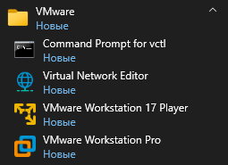

# Установка гипервизора и создание виртуальных машин
1. [Настройка гипервизора](#настройка-гипервизора)
2. [Установка виртуальной машины](#установка-виртуальной-машины)
	1. [Создание новой ВМ](#создание-новой-вм)
	2. [Установка ОС на ВМ](#установка-ос-на-вм)
		1. [Установка Rocky Linux в графическом режиме](#установка-rocky-linux-в-графическом-режиме)
3. [Организация удалённого доступа к ВМ](#организация-удалённого-доступа-к-вм)
	1. [Первоначальная подготовка](#первоначальная-подготовка)
	2. [Первый способ генерации и копирования SSH ключей](#первый-способ-генерации-и-копирования-ssh-ключей)
		1. [Первый метод копирования SSH ключей](#первый-метод-копирования-ssh-ключей)
		2. [Второй метод копирования SSH ключей](#второй-метод-копирования-ssh-ключей)
		3. [Третий метод копирования SSH ключей](#третий-метод-копирования-ssh-ключей)
	3. [Второй способ генерации и копирования SSH ключей](#второй-способ-генерации-и-копирования-ssh-ключей)

---

##### Цель работы:
>Получить навыки по работе с гипервизором, развертыванию виртуальной инфраструктуры, удаленному подключению к ВМ и настройке SSH ключей.

---

## Настройка гипервизора
>[!NOTE]
>Виртуальные машины широко применяются в среде разработки ПО для тестирования нового функционала без ущерба для производственного контура. Для создания новых и управления имеющимися ВМ используется программа, называемая гипервизором. Она позволяет выделить ресурсы компьютера-хоста и отдать их в распоряжение операционной системы виртуальной машины. На рынке представлено несколько продуктов от разных производителей, в данной работе выбор был сделан в пользу гипервизора Workstation компании VMware.

После установки гипервизора (данный этап был описан здесь: [подготовка к лабораторным работам](Preparation_for_labs.md/#Подготовка-к-лабораторным-работам)) на вашем ПК будут доступны следующие программы:

- Command Prompt for vctl – утилита командной строки VMware для управления контейнерами (нам она не пригодится);
- Virtual Network Editor – средство настройки виртуальных сетей;
- VMware Workstation 17 Player – программа для запуска ВМ;
- VMware Workstation Pro – гипервизор.



Перед началом работы непосредственно с гипервизором проверим настройки виртуальных сетей. Для этого откроем Virtual Network Editor с *правами администратора*, так как она вносит изменения в конфигурацию сетевых адаптеров хоста (в данных лабораторных в качестве него будет ваш ПК).

После открытия в верхней части окна можно увидеть таблицу с настроенными виртуальными сетями, а в нижней конфигурацию выбранной сети. По умолчанию преднастроено три сети разного типа:

- VMnet0 – сеть типа **мост** (bridged). Данный тип сетевого подключения создает прозрачный мост между интерфейсом ВМ и сетевым интерфейсом хоста. В его настройках лучше задать выбор интерфейса хоста статично, особенно в том случае, если на компьютере или ноутбуке несколько таких интерфейсов. Виртуальные машины, подключенные мостом, будут воспринимать сеть хоста так, будто они сами непосредственно подключены к ней.


- VMnet1 – сетевое подключение типа **внутренняя сеть** (host-only). Такая сеть объединяет подключенные в нее ВМ, но не предназначена для выхода в интернет. В настройках можно создать виртуальный сетевой адаптер для хоста в этой сети, таким образом организовав сетевую связность хоста и виртуальных машин в этой сети. Также можно настроить протокол DHCP для автоматического конфигурирования сетевых интерфейсов виртуальных машин.


- VMnet8 – сеть типа **NAT** (Network Address Translation). Данная сеть предназначена для доступа ВМ к глобальной сети, однако в случае отправки запроса во внешний мир производится подмена IP-адреса источника на IP-адрес активного интерфейса хоста. Внутри же сети узлы обмениваются информацией, используя недоступные глобально IP-адреса. Теперь в рамках настроек DHCP имеется возможность не только управлять стандартными параметрами выдачи IP-адресов, масок подсетей и шлюзов, но и настраивать правила NAT.


Давайте проверим присутствие соответствующих сетевых интерфейсов на хосте. В случае Windows проверить это можно открыв PowerShell (оболочка командной строки Windows) и введя команду:

```bash
Get-NetIPAddress -AddressFamily IPv4 -InterfaceAlias "VMware*" | Format-Table -Property InterfaceAlias, IPAddress
```


Как видно на скрине выше, в системе присутствуют два виртуальных интерфейса из рассмотренных ранее сетей VMnet1 и VMnet8. Причем IP-адреса соответствуют диапазонам указанным в настройках виртуальных сетей.

В данной работе необходимо обеспечить доступ ВМ в глобальную сеть, используя сетевые интерфейсы NAT или bridge.

---

## Установка виртуальной машины
### Создание новой ВМ
>[!NOTE]
>Виртуальные машины используют ресурсы хоста. Перед тем, как создавать новые виртуальные машины, необходимо подумать о том, сколько ресурсов им потребуется, а также подготовить носители загрузочных образов операционных систем. Гипервизор позволяет смонтировать ISO-образ диска, физический дисковод или загрузочную флэшку.

Для создания ВМ откроем гипервизор и воспользуемся кнопкой `Create a New Virtual Machine`, либо как продвинутые пользователи комбинацией `Ctrl+N`.


Дальше откроется окно конфигурации новой ВМ. В нем выбираем второй пункт (Custom), чтобы иметь возможность тонкой настройки нашей ВМ на этапе установки.


Следующий пункт – настройка обратной совместимости с предыдущими версиями Workstation или ESXi (это промышленный гипервизор от VMware).


Следующий шаг установки позволяет выбрать заранее подготовленный образ установочного диска. Если вдруг вы обнаружили, что дошли до этого шага, а образа под рукой нет (его можно установить с флешки, которую можно взять у преподавателя), то в этой работе использовался Rocky Linux, доступный для загрузки по [ссылке](https://rockylinux.org/download/).


Потом можно написать название виртуальной машины и выбрать место размещения её файлов.


Далее назначаем количество используемых процессоров и ядер. Для этих работ большого количества ресурсов не понадобится, но и зажимать их не стоит.


Также устанавливаем объем оперативной памяти для ВМ.


Выберем вариант сетевых настроек. Следует использовать варианты, позволяющие получить доступ в интернет с виртуальной машины.


В следующих двух шагах нужно выбрать тип SCSI контроллера устройств ввода-вывода и тип жесткого диска (лучше использовать рекомендуемые опции).


Создадим новый виртуальный жесткий диск.


Дальше укажем размер файла жесткого диска и шаблон для имени этого файла:


Завершаем создание ВМ.


После создания виртуальная машина появится в списке слева, станет доступна консоль управления виртуальной машиной:


🎉 Поздравляю, первый шаг пройден!!!

### Установка ОС на ВМ
Если после создания ВМ не включилась автоматически, то для запуска следует выбрать пункт `Power on this virtual machine` с иконкой зеленого треугольника. После старта загрузится установщик операционной системы:


#### Установка Rocky Linux в графическом режиме
>[!NOTE]
>В процессе установки имеется возможность установить дату и время, раскладку клавиатуры, источник установки ПО (репозиторий), разметку диска, сетевые настройки и не только. Порядок не важен за исключением выбора сетевого репозитория – его нужно подключать после предоставления ВМ доступа в сеть.

Выбираем язык (желательно выбирать *английский язык*, так как выдаваемый на нём отчёт об ошибке позволит найти более релевантные ресурсы в Гугле):


>[!WARNING]
>Если вместо графической оболочки установщика вы видите серый экран, то нужно:
>1. Остановить ВМ.
>2. Открыть настройки виртуальной машины.
>3. Перейти в пункт `Display`.
>4. Снять галочку напротив пункта `Accelerate 3D graphics`.

Все настройки установки разбиты по группам. Пройдемся по ним последовательно.


Первая группа – ***Localization***. В ней можно выбрать настройки клавиатуры, поддержку языков локализации и часовой пояс:


Следующая группа настроек – ***Software***. В ней можно выбрать, какие пакеты будут установлены, а также источник (зеркало или репозиторий), откуда эти пакеты будут загружены. 

В случае, если был загружен образ minimal (Rocky-10.0-x86_64-minimal.iso), устанавливать операционную систему можно прямо с него. Если же был загружен образ boot (Rocky-10.0-x86_64-boot.iso), то необходимо задать сетевой источник загрузки. Проверить, какой образ используете именно вы можно в настройках виртуальной машины:


В данном случае ОС устанавливается с образа minimal, поэтому в разделе **Installation Source** выберем `Auto-detected installation source`. При использовании boot можно выбрать пункт `On the network` и `Closest mirror` или указать предпочитаемый источник, но если на данном этапе не настроена сеть, то проверка выбранного источника провалится и возникнет ошибка.


В любом случае, в разделе **Software Selection** из всех предложенных вариантов следует выбрать минимальную установку, т.к. все необходимые программы будут установлены нами самостоятельно.

В случае установки с диска без добавления внешних репозиториев окно выбора может как на скриншоте ниже. В правом столбце важно выбрать пункт `Standard`, он включает в себя архиватор **tar**, который потребуется для запуска серверной части Visual Studio Code.


Следующая группа настроек - ***System***. В ней можно выбрать параметры дисковой и сетевой подсистем, kdump и профили безопасности.

В разделе **Installation Destination** (Расположение установки) необходимо произвести разметку диска. Чтобы иметь возможность управлять разделами, следует выбрать пункт `Custom`, после чего можно выбрать автоматическое разбиение и исправить его в случае необходимости.


Для перехода к **Manual Partitioning** нужно нажать `Done`.


В конце можно ознакомиться со списком вносимых изменений и принять их. На этом работа с диском завершена.


Следующим в настройке идет **KDUMP**, в котором нам нужно отключить (вот так совпадение) kdump.


В разделе **Network & Host Name** (Сеть и имя узла) можно настроить сеть. Если на этапе создания ВМ выбран тип интерфейса NAT и в настройках виртуальной сети включен DHCP сервер, то в параметрах IPv4 сетевого адаптера следует выбрать автоматический метод получения сетевых настроек. Если выбран режим bridge и в сети хоста развернут сервер DHCP, также следует выбрать автоматический метод получения сетевых настроек. В других случаях необходимо статически назначить IP-адрес, маску подсети и другие сетевые настройки.


После того как интерфейс включен и ему присвоен IP-адрес, можно проверить доступность виртуальной машины с хоста. Для этого откроем PowerShell и введём команду (используйте IP-адрес вашей ВМ!):

```bash
ping 192.168.243.128
```


Следующая и последняя группа настроек - ***User Settings***. Она отвечает за настройку учетных записей root и пользователя. Это важный шаг, *пароли рекомендуется записать*.

В разделе **Root Account** опция `Allow root SSH login with password` разрешает удаленное подключение к виртуальной машине по протоколу ssh под учетной записью root. Эта практика не считается безопасной. Далее будет показано, как настроить логин по ключам без использования паролей, что является более безопасным решением.


В самой нижней части интерфейса инсталляционного меню притаился еще один пункт – **User Creation**. Он позволит создать нового пользователя, под которым и будут осуществляться все дальнейшие действия. 

Создадим нового пользователя, не забыв сделать его администратором. В качестве имени пользователя *используем собственную фамилию и инициалы* (как пример: PetrovEV), а все дальнейшие действия будут выполняться от имени этого пользователя. Опция `Add administrative privileges to this account` позволяет создаваемой учетной записи выполнять команды от имени суперпользователя, что потребуется при установке пакетов программного обеспечения и работы с системными сервисами.


Ну а теперь можно приступать к установке, нажимаем `Begin Installation`. 


Ждём завершения установки и перезагружаем ВМ кнопкой `Reboot System`.


На данном этапе у нас есть виртуальная машина с доступом в интернет и развернутой ОС Rocky Linux. Дальше только интереснее!

---

## Организация удалённого доступа к ВМ
### Первоначальная подготовка
>[!NOTE]
>После установки ОС для взаимодействия с ней по сети необходимо настроить IP-адрес вручную или узнать, какой был присвоен динамически. Узнав его мы сможем удаленно подключаться к консоли по протоколу ssh, загружать файлы по sftp и/или scp, установить и использовать различные сервисы и приложения.


### Первый способ генерации и копирования SSH ключей


#### Первый метод копирования SSH ключей


#### Второй метод копирования SSH ключей


#### Третий метод копирования SSH ключей


### Второй способ генерации и копирования SSH ключей