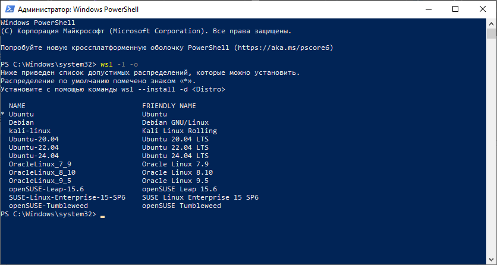
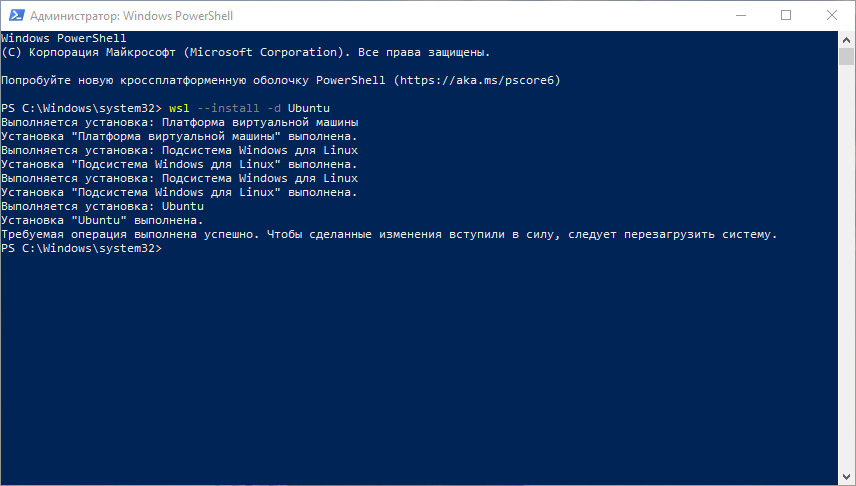

# Установка гипервизора и создание виртуальных машин
1. [Настройка гипервизора](#Настройка-гипервизора)
2. [Установка виртуальной машины](#Установка-виртуальной-машины)
	1. [Создание новой ВМ](#Создание-новой-ВМ)
	2. [Установка ОС на ВМ](#Установка-ОС-на-ВМ)
		1. [Установка Rocky Linux в графическом режиме](#Установка-Rocky-Linux-в-графическом-режиме)
3. [Организация удалённого доступа к ВМ](#Организация-удалённого-доступа-к-ВМ)
	1. [Первоначальная подготовка](#Первоначальная-подготовка)
	2. [Первый способ генерации и копирования SSH ключей](#Первый-способ-генерации-и-копирования-SSH-ключей)
		1. [Первый метод копирования SSH ключей](#Первый-метод-копирования-SSH-ключей)
		2. [Второй метод копирования SSH ключей](#Второй-метод-копирования-SSH-ключей)
		3. [Третий метод копирования SSH ключей](#Третий-метод-копирования-SSH-ключей)
	3. [Второй способ генерации и копирования SSH ключей](#Второй-способ-генерации-и-копирования-SSH-ключей)

---

##### Цель работы:
>Получить навыки по работе с гипервизором, развертыванию виртуальной инфраструктуры, удаленному подключению к ВМ и настройке SSH ключей.

---

## Настройка гипервизора

---

## Установка виртуальной машины
### Создание новой ВМ

### Установка ОС на ВМ

### Установка Rocky Linux в графическом режиме

---

## Организация удалённого доступа к ВМ
### Первоначальная подготовка

### Первый способ генерации и копирования SSH ключей

#### Первый метод копирования SSH ключей

#### Второй метод копирования SSH ключей

#### Третий метод копирования SSH ключей

### Второй способ генерации и копирования SSH ключей