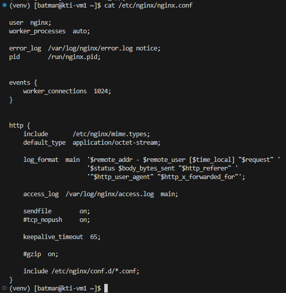
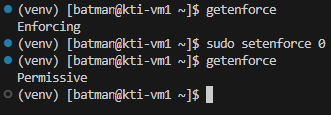

# Установка Python и запуск веб-сервера Flask
1. [Установка и настройка Python](#установка-и-настройка-python)
	1. [Сборка Python из исходников](#сборка-python-из-исходников)
	2. [Запуск простого веб-приложения](#запуск-простого-веб-приложения)
2. [Установка веб-сервера NGINX](#установка-веб-сервера-nginx)
3. [Управление конфигурацией веб-сервера NGINX](#управление-конфигурацией-веб-сервера-nginx)
4. [Установка и запуск WSGI-сервера](#установка-и-запуск-wsgi-сервера)
5. [Использование СУБД для хранения информации](#использование-субд-для-хранения-информации)

---

##### Цель работы:
>Получить навыки по установке и сборке из исходного кода пакетов в Linux, запуску веб-приложений Flask

---

## Установка и настройка Python
### Сборка Python из исходников
Python может быть включен в состав установленного дистрибутива linux. Проверить это можно, например командой:

```bash
python3 --version
```

или

```bash
python3 -V
```


Как мы видим, у нас уже установлен Python версии 3.12.9. Однако на момент написания, последняя стабильная версия - 3.13.7, посмотреть актуальный релиз можно в [официальном репозитории](https://github.com/python/cpython/tags):


Обновить python можно несколькими способами: скачать новый пакет из репозитория или собрать самостоятельно из исходников. В целях расширения кругозора выберем второй способ.

Прежде чем собирать пакет из исходников, установим некоторое вспомогательное ПО с помощью команды:

```bash
sudo dnf install gcc make zlib-devel bzip2-devel openssl-devel xz-devel libffi-devel ncurses-devel sqlite-devel libuuid-devel git -y
```


Исходный код можно получить одним из способов:
- или клонировать репозиторий и переключиться на стабильную ветку (ключ `-b` позволяет указать клонируемую ветку (branch)):

```bash
git clone -b v3.13.7 https://github.com/python/cpython.git
```


После клонирования должна появиться директория `cpython`, проверить это можно введя в консоль:

```bash
ls
```


- или скачать архив с исходным кодом и распаковать его:

```bash
curl -O https://www.python.org/ftp/python/3.13.7/Python-3.13.7.tgz
```

```bash
tar zxf Python-3.13.7.tgz
```

В данном случае, если посмотреть содержимое домашней директории, можно увидеть архив `Python-3.13.7.tgz` и его распакованную версию.


В нашем случае отдадим приоритет **клонированию репозитория**.

Для дальнейших действий нам нужно перейди в директорию `cpython`:

```bash
cd cpython
```


Теперь, находясь в папке с исходниками, мы можем сконфигурировать сборку Python и выполнить ее. Конфигурация выполняется командой:

```bash
./configure --enable-optimizations
```


После завершения конфигурации собрать Python можно командой:

```bash
make -s -j2
```


Возникшие в процессе сборки оповещения являются следствием опции enable-optimizations. Сборка Python завершена, в текущей директории находится исполняемый файл. Проверим это:

```bash
ls -ahl python
```

```bash
./python -V
```


Следующим этапом будет установка Python, для этого понадобится выполнить команду с правами суперпользователя:

```bash
sudo make -s -j2 install
```

После установки получим следующий результат:


Так происходит, потому что python3.12, поставляемый с дистрибутивом операционной системы, установлен в каталог `/usr/bin`, а собранный нами python3.13 - в `/usr/local/bin`, то есть не произошло перезаписи одной версии на другую. Проверить, так ли это можно при помощи команды:

```bash
which python3
```


Свежая версия уже доступна по алиасу python3, потому что изменена символьная ссылка `/usr/bin/python3`, которая ведет к исполняемому файлу python3.13. Проверить, это можно введя:

```bash
ls -ahl /usr/local/bin/python3
```


Для установки пакетов python используется пакетный менеджер pip. Он был установлен вместе с новой версией Python и его исполняемый файл - `/usr/local/bin/pip3.13`. Однако его удобнее вызывать как pip3.


В дальнейшем для установки необходимых пакетов достаточно воспользоваться командой:

```bash
pip3 install package_name
```

### Запуск простого веб-приложения
>[!NOTE]
>При разработке хорошим тоном считается создавать виртуальное окружение, в которое уже загружать необходимые пакеты. Это легко контролируется, не вредит нашей операционной системе и уберегает от конфликтов версий. 

Создадим виртуальное окружение, но перед этим вернёмся в домашнюю директорию:

```bash
cd
```

Теперь приступим к созданию:

```bash
mkdir -p flask_project
```

```bash
cd flask_project
```

```bash
python3 -m venv venv
```

Мы создали виртуальное окружение в директории `flask_project`, теперь активируем его:

```bash
source venv/bin/activate
```


После выполнения команд можно заметить появившуюся директорию `venv` в папке `flask_project`. Также после активации изменилось приглашение к вводу командной строки, указывающее, что виртуальное окружение активировано.


В директории `venv/bin` находятся символьные ссылки и исполняемые файлы python и pip той версии, которые были использованы при создании виртуального окружения. Другими словами, в виртуальном окружении python и pip можно вызывать без указания версии в названии программы.


Пакеты можно устанавливать из репозитория [PyPI](https://pypi.org/) или указывая ссылку для загрузки. Установить Flask можно командой:

```bash
pip install flask
```


Для проверки работоспособности Flask сделаем простейшее приложение. Создадим в папке `flask_project` директорию `flask_app`, в ней файл `app.py` следующего содержания:

```python
from flask import Flask


app = Flask(__name__)


@app.route("/")
def hello_world():
    return "<p>Hello, World!</p>"
```


>[!NOTE]
>Разберем написанный код. На первой строке из модуля flask импортируется класс Flask, экземпляром которого будет наше приложение. Далее объявляется экземпляр этого класса с аргументом `__name__`. Затем используется декоратор route, сообщающий flask, какой URL должен обрабатываться следующей за ним функцией. Функция в свою очередь возвращает HTML, который будет отображен в браузере.

*Не забудьте* сохранить изменения в файле с помощью хоткея `Ctrl+s`.

Так же для работы с Python в VS Code рекомендуется установить соответствующее расширение (об этом написано [здесь](Preparation_for_labs.md/#установка-vs-code-и-расширений)).


После установки расширения можно выбрать интерпретатор. В случае, если интерпретатор был выбран автоматически, возникнет предупреждение о том, что невозможен импорт из модуля flask.


Это связано с тем, что установленное расширение по умолчанию использует системный интерпретатор и ничего не знает о настроенном нами виртуальном окружении. Посмотреть на используемый интерпретатор можно нажав на версию Python в правом нижнем углу.


Следует указать расширению путь к интерпретатору используемому нами в виртуальном окружении.  Его можно узнать из вывода команды:

```bash
which python
```


Теперь запустим наше приложение. Находясь в папке `flask_app` пропишем:

```bash
flask run
```


Сообщение `Running on http://127.0.0.1:5000` говорит о том, что приложение запущено и доступно по порту 5000. VS Code заботливо пробросит порт в сетевое окружение хоста, так что URL доступен в браузере:


По умолчанию flask запускается и прослушивает только адрес локального сетевого адаптера (localhost). Чтобы получать запрос с других адаптеров, необходимо передать адрес этого сетевого интерфейса при запуске или разрешить принимать подключение со всех сетевых адаптеров. За такое поведение отвечает опция `--host`:

```bash
flask run --host=0.0.0.0
```


В отличие от прошлого запуска в выводе добавилась строка `Running on http://192.168.126.128:5000`. Однако, если попытаться открыть этот URL, увидим ошибку:


Несмотря на то, что порт прослушивается и приложение ожидает подключение по IP-адресу интерфейса виртуальной машины, клиентские запросы из браузера не могут достичь сервера. Все дело в настройках файрволла. Посмотреть список правил можно командой:

```bash
sudo firewall-cmd --list-all
```


Чтобы исправить ситуацию, необходимо открыть порт 5000 в настройках файрволла:

```bash
sudo firewall-cmd --add-port=5000/tcp
```

Вторая команда нужна для сохранения введенных настроек.

```bash
sudo firewall-cmd --runtime-to-permanent
```


После чего мы видим нужный результат!


Этого достаточно для локальной разработки, однако в промышленных контурах пользовательские запросы не приходят сразу на сервер приложений, перед этим они проходят через серверы балансировки и распределения нагрузки.

---

## Установка веб-сервера NGINX
>[!NOTE]
>В данной работе веб-сервер NGINX будет использован как обратный прокси-сервер, принимающий запросы пользователя и перенаправляющий их на бэкенд - Flask-приложение.

>[!NOTE]
>Как и подавляющее большинство программного обеспечения, установить веб-сервер nginx на centos можно из репозитория. Для этого можно воспользоваться репозиторием с диска, стандартным преднастроенным репозиторием или добавить репозиторий от разработчика.

Воспользуемся третьим вариантом с целью получить последнюю версию ПО. Прежде всего следует обратиться на сайт разработчика ([рабочая ссылка](https://nginx.org/ru/linux_packages.html#RHEL) на момент написания данного руководства). Воспользуемся предложенным вариантом установки. Создадим новый файл репозитория с помощью **ЛУЧШЕГО** текстового редактора **vi** командой:

```bash
sudo vi /etc/yum.repos.d/nginx.repo
```

Текст можно набрать вручную или скопировать со страницы сайта. В любом случае, прежде чем добавлять контент, необходимо перейти в режим редактирования, нажав `i` (после этого режим поменяется на INSERT, о чем говорит появившаяся снизу надпись).


Чтобы сохранить файл можно нажать комбинацию клавиш `Shift+ZZ` или клавишу `Esc`, после чего написать `:wq`.


Проверим, сохранились ли изменения в файле:

```bash
cat /etc/yum.repos.d/nginx.repo
```


Теперь, после проверки содержимого файла посмотрим, какую версию и из какого репозитория будет устанавливать пакетный менеджер.

```bash
dnf info nginx
```


Теперь установим NGINX при помощи команды:

```bash
sudo dnf install nginx -y
```


Веб-сервер можно запустить как службу (процесс в фоне). Для этого можно воспользоваться командой `systemctl`, позволяющей управлять процессами в Linux. Несколько полезных вариантов применения этой команды:

| Команда                        | Описание                                  |
|--------------------------------|-------------------------------------------|
| `systemctl start nginx`        | запустить сервис                          |
| `systemctl stop nginx`         | остановить сервис                         |
| `systemctl restart nginx`      | перезапуск сервиса                        |
| `systemctl enable nginx`       | добавить сервис в автозагрузку            |
| `systemctl enable --now nginx` | добавить в автозагрузку и сразу запустить |
| `systemctl status nginx`       | показать состояние сервиса                |

Мы же воспользуемся командой:

```bash
sudo systemctl enable --now nginx
```

И проверим, что веб-сервер успешно стартовал и готов принимать http-запросы:

```bash
systemctl enable --now nginx
```


Откроем в браузере страницу по IP-адресу нашей ВМ. NGINX запущен, однако доступа к сайту нет.


Мы уже сталкивались с подобной ситуацией, необходимо добавить в настройки файрволла еще несколько разрешающих правил. В настройках файрволла по умолчанию нет разрешающих правил для протоколов **http** и **https**, которые используются браузером при обращении к веб-серверу. Исправить это можно командами:

```bash
sudo firewall-cmd --add-service=http
```

```bash
sudo firewall-cmd --add-service=https
```

```bash
sudo firewall-cmd --runtime-to-permanent
```

После чего можно проверить конфигурацию файрволла.


Если все настроено правильно, то в браузере по IP-адресу нашей виртуальной машины откроется стартовая страница NGINX.



Сработало.

---

## Управление конфигурацией веб-сервера NGINX
>[!NOTE]
>Файл конфигурации NGINX по умолчанию находятся в каталоге `/etc/nginx` и называется `nginx.conf`:
>
>
>
>Содержимое конфигурационного файла `nginx.conf` по умолчанию различается от версии к версии, далее приведено актуальное на момент написания руководства:
>
>```nginx
>user  nginx;
>worker_processes  auto;
>
>error_log  /var/log/nginx/error.log notice;
>pid        /var/run/nginx.pid;
>
>
>events {
>    worker_connections  1024;
>}
>
>
>http {
>    include       /etc/nginx/mime.types;
>    default_type  application/octet-stream;
>
>    log_format  main  '$remote_addr - $remote_user [$time_local] "$request" '
>                      '$status $body_bytes_sent "$http_referer" '
>                      '"$http_user_agent" "$http_x_forwarded_for"';
>
>    access_log  /var/log/nginx/access.log  main;
>
>    sendfile        on;
>    #tcp_nopush     on;
>
>    keepalive_timeout  65;
>
>    #gzip  on;
>
>    include /etc/nginx/conf.d/*.conf;
>}
>```
>
>В [официальном руководстве](https://nginx.org/ru/docs/beginners_guide.html#conf_structure) описана структура конфигурационного файла, иерархически состоящая из модулей и директив. Внешние файлы можно подключить директивой `include`, например, `include /etc/nginx/conf.d/*.conf` позволяет включать в конфигурацию все файлы из папки `/etc/nginx/conf.d/`, оканчивающиеся на `.conf`. Таким образом для каждого сайта можно создать отдельный конфигурационный файл, что считается хорошим тоном. По умолчанию в этой директории находится файл `default.conf` следующего содержания:
>
>```nginx
>server {
>    listen       80;
>    server_name  localhost;
>
>    #access_log  /var/log/nginx/host.access.log  main;
>
>    location / {
>        root   /usr/share/nginx/html;
>        index  index.html index.htm;
>    }
>
>    #error_page  404              /404.html;
>
>    # redirect server error pages to the static page /50x.html
>    #
>    error_page   500 502 503 504  /50x.html;
>    location = /50x.html {
>        root   /usr/share/nginx/html;
>    }
>
>    # proxy the PHP scripts to Apache listening on 127.0.0.1:80
>    #
>    #location ~ \.php$ {
>    #    proxy_pass   http://127.0.0.1;
>    #}
>
>    # pass the PHP scripts to FastCGI server listening on 127.0.0.1:9000
>    #
>    #location ~ \.php$ {
>    #    root           html;
>    #    fastcgi_pass   127.0.0.1:9000;
>    #    fastcgi_index  index.php;
>    #    fastcgi_param  SCRIPT_FILENAME  /scripts$fastcgi_script_name;
>    #    include        fastcgi_params;
>    #}
>
>    # deny access to .htaccess files, if Apache's document root
>    # concurs with nginx's one
>    #
>    #location ~ /\.ht {
>    #    deny  all;
>    #}
>}
>```
>
>Директива `server` задает виртуальный сервер, который прослушивает порт 80 (`listen 80`), что соответствует протоколу **http**, этот сервер будет обрабатывать запросы по доменному имени localhost (`server_name localhost`).
>
>Директива `location` указывает, где в файловой системе расположены html или другие файлы, содержимое которых следует обработать по запросу определенных URL. В рассматриваемом файле URL представляет собой корень сайта – на это указывает символ `/`. Таким образом, при запросе странички сайта `http://localhost` веб-сервер будет искать файлы для обработки в директории `/usr/share/nginx/html`, на что указывает директива `root`. Директива `index` указывает, какие файлы следует обработать в случае, если имя файла не задано в URL.
>
>Если заглянуть в директорию `/usr/share/nginx/html`, то там можно обнаружить файл index.html, его содержимое является страничкой приветствия nginx:
>
>```html
><!DOCTYPE html>
><html>
><head>
><title>Welcome to nginx!</title>
><style>
>html { color-scheme: light dark; }
>body { width: 35em; margin: 0 auto;
>font-family: Tahoma, Verdana, Arial, sans-serif; }
></style>
></head>
><body>
><h1>Welcome to nginx!</h1>
><p>If you see this page, the nginx web server is successfully installed and
>working. Further configuration is required.</p>
>
><p>For online documentation and support please refer to
><a href="http://nginx.org/">nginx.org</a>.<br/>
>Commercial support is available at
><a href="http://nginx.com/">nginx.com</a>.</p>
>
><p><em>Thank you for using nginx.</em></p>
></body>
></html>
>```

При желании развернуть собственный веб-сайт следует создать новый виртуальный сервер при помощи директивы `server`, в `location` которого указать путь к папке с html-файлами.

NGINX зачастую используют как обратный прокси (запрос от пользователя принимается NGINX и перенаправляется к приложению). Напишем для этого отдельный конфигурационный файл, а дефолтный сохраним c расширением `.bkp`, чтобы конфиг из него не считывался.

У каталога `/etc/nginx` владелец – пользователь root, а у обычного пользователя по умолчанию нет прав изменять в нем файлы. Проверим это:

```bash
ls -hl /etc/nginx/conf.d/
```


Так сделано в целях безопасности. В рамках данной работы изменим права на директорию `/etc/nginx/conf.d`, в которой создадим свой конфигурационный файл. Простейшим способом получить права является использование команды `chmod`:

```bash
sudo chmod -R o+w /etc/nginx/conf.d/
```


Перейдём директорию `conf.d` и переименуем файл:

```bash
mv ./default.conf ./default.conf.bkp
```

Проверить новое название можно командой `ls`.


В папке `conf.d` создадим файл `flask_app.conf` следующего содержания:

```nginx
server {
    listen 80;
    server_name _;

    location / {
        proxy_pass http://localhost:5000;
    }
}
```


>[!NOTE]
>Директива `proxy_pass` указывает на то, что все запросы, полученные по URL данного `location` (в данном случае `/` - это корень сайта) необходимо проксировать на `http://localhost:5000`.

Nginx позволяет проверить синтаксис конфигурации командой:

```bash
nginx -t
```

Перечитать конфиг можно командой:

```bash
sudo nginx -s reload
```


Теперь nginx будет перенаправлять все пришедшие запросы на наше приложение и отдавать пользователю ответ от него.

Запустим наше приложение и попробует открыть его в браузере по IP-адресу ВМ.


Пу-пу-пу… Причиной ошибки 502 может быть отсутствие запущенного приложения на 5000 порту.

В правом углу терминала откроем новую консоль, чтобы не останавливать наше приложение.


И в новой консоли введём команду которая поможет нам проверить, прослушивается ли порт 5000:

```bash
ss -tpln | grep 5000
```


На удивление всё в порядке, тогда пролить свет истины на возникшую ситуацию может помочь чтение логов NGINX, например так:

```bash
sudo tail -f /var/log/nginx/error.log
```



В логах видно строчки: `2025/09/24 23:18:04 [crit] 9286#9286: *9 connect() to 127.0.0.1:5000 failed (13: Permission denied) while connecting to upstream, client: 192.168.243.1, server: _, request: "GET / HTTP/1.1", upstream: "http://127.0.0.1:5000/", host: "192.168.243.128"`. Судя по этим записям, подключение к бэкенду `127.0.0.1:5000` не удалось, потому что запрещен доступ. В данном случае эта ситуация вызвана работой **SELinux** (Security-Enhanced Linux), он блокирует подключение NGINX к Flask-приложению. Проверить, включен ли SELinux можно командой:

```bash
getenforce
```

А выключить до следующей перезагрузки можно так:

```bash
sudo setenforce 0
```


Попробуем снова подключиться.


После выполнения всех указанных операций была получена работоспособная и в некоторой степени безопасная конфигурация.

---

## Установка и запуск WSGI-сервера
При запуске Flask возникает предупреждение: `WARNING: This is a development server. Do not use it in a production deployment. Use a production WSGI server instead.`

Займемся установкой и настройкой WSGI-сервера. Он позволяет автоматизировать запуск и удобно масштабировать веб-приложения. В данной работе применяется WSGI-сервер Gunicorn. Установим Gunicorn в виртуальное окружение командой:

```bash
pip install gunicorn
```

После установки нужно убедиться, что Gunicorn может правильно обслуживать приложение. Для запуска gunicorn'у необходимо предать название модуля и имя переменной с приложением в формате `$(MODULE_NAME):$(VARIABLE_NAME)`. Имя модуля в нашем случае - название файла `app.py` без расширения, а имя переменной является именем вызываемого объекта в этом модуле, в нашем случае - `app`. В результате команда запуска примет вид:

```bash
gunicorn app:app
```


Судя по выводу, приложение прослушивает сокет `127.0.0.1:8000`. В целях отладки откроем порт 8000 и укажем другой сокет так, чтобы можно было получить ответ в браузере на хосте:

```bash
sudo firewall-cmd --add-port=8000/tcp
```

```bash
sudo firewall-cmd --runtime-to-permanent
```

```bash
gunicorn -b 0.0.0.0 app:app
```


Откроем страницу а браузере.


Одной из возможностей Gunicorn является запуск нескольких рабочих процессов - worker. Изменим код нашего приложения `app.py` так, чтобы в ответ оно отдавало строку с Process id:

```python
from flask import Flask
import os


app = Flask(__name__)


@app.route("/")
def hello_world():
    pid = os.getpid()
    return f"Process ID: {pid}"


if __name__ == '__main__':
    app.run()
```


>[!NOTE]
>Условие `if __name__ == "__main__"` выполняется в случае, если файл вызван на исполнение напрямую (например командой `python wsgi.py`), а не импортирован из другого файла. Таким образом, можно запускать приложение напрямую для отладки, а целевой схемой останется запуск посредством Gunicorn.

Выполним запуск командой с указанием количества worker-процессов:

```bash
gunicorn -w 3 -b 0.0.0.0 app:app
```


В выводе видно номера запущенных процессов. Проверим, что странички открываются c разными номерами:


Один из важных выводов из проделанного - это возможность принимать запросы, используя один сокет, и перенаправлять их на несколько различных бэкендов.

Займемся автоматизацией запуска нашего приложения. В Linux существует множество вариантов настроить автозапуск, в данной работе рассматривается вариант с использованием systemd. Systemd - это набор базовых компонентов Linux, обладающий обширным функционалом, в том числе предлагающий развитую логику управления службами. Мы уже работали с systemd, запуская и перезапуская nginx командой `systemctl`. Службы в systemd описываются в так называемых unit-файлах. Создадим такой файл для запуска Gunicorn.

```bash
mkdir -p ~/.config/systemd/user/
```

```bash
vi ~/.config/systemd/user/flask_app.service
```

Внутри напишем:

```conf
[Unit]
Description=Gunicorn instance to serve flask_app
Requires=flask_app.socket
After=network.target

[Service]
Type=notify
RuntimeDirectory=gunicorn
WorkingDirectory=%h/flask_project/flask_app
Environment="PATH=%h/flask_project/venv/bin"
ExecStart=%h/flask_project/venv/bin/gunicorn \
          --access-logfile - \
          --workers 1 \
          --bind unix:/tmp/flask_app.sock \
          app:app

[Install]
WantedBy=multi-user.target
```


Создадим unit-файл с описанием файлового сокета, через который будет идти обмен сообщений между NGINX и нашим приложением:

```bash
vi ~/.config/systemd/user/flask_app.socket
```

```conf
[Unit]
Description=gunicorn socket

[Socket]
ListenStream=127.0.0.1:8000

[Install]
WantedBy=sockets.target
```


И теперь внесем в конфиг NGINX (`flask_app.conf`) следующие изменения:

```bash
vi /etc/nginx/conf.d/flask_app.conf
```

```nginx
upstream flask_app {
    server 127.0.0.1:8000;
}

server {
    listen 80;
    server_name _;

    location / {
        proxy_set_header X-Forwarded-For $proxy_add_x_forwarded_for;
        proxy_set_header X-Forwarded-Proto $scheme;
        proxy_set_header Host $http_host;
        proxy_redirect off;
        # proxy_pass http://127.0.0.1:5000;
        proxy_pass http://flask_app;
    }
}
```


В итоге должна получится такая картина:


После подготовки всех файлов перезапустим nginx и включим сокет нашего приложения:

```bash
sudo nginx -s reload
```

```bash
systemctl --user enable --now flask_app.socket
```

Проверим состояние нашего сокета.

```bash
systemctl --user status flask_app.socket
```


Если все выполнено верно, то NGINX и системный сокет автоматически запустятся после загрузки операционной системы. А значит после перезагрузки виртуальной машины наше приложение начнет работать и будет доступно по 80 порту. После старта сокета можно произвести проверку в браузере.

---

## Использование СУБД для хранения информации
>[!NOTE]
>Для сохранения информации пользователей в приложениях обычно используются базы данных, которые управляются **системами управления базами данных** (СУБД). В качестве примера таких систем можно привести mysql, postgresql, etcd, MongoDB, sqlite. СУБД обычно разворачивают на отдельном высокопроизводительном сервере, однако для небольших проектов или в среде тестирования и разработки допускается развертывание локальных инстансов.

Мы запустим СУБД локально, воспользовавшись решением sqlite. Развернем проект, содержащий страницы регистрации, входа и выхода с сохранением пользовательских данных в базе данных.

В начале находясь в папке `flask_project` введём команду:

```bash
rm -rf flask_app/
```

После чего клонируем проект из репозитория:

```bash
git clone https://github.com/kottik-mypp/flask_app.git
```


Перейдём в директорию `flask_app`, где в файле `requirements.txt`  описаны необходимые для запуска приложения модули и пакеты. Установить их можно, воспользовавшись этим файлом с помощью команды:

```bash
pip install -r requirements.txt
```


Просмотреть список установленных модулей можно командой:

```bash
pip list
```


Дальше перезапустим службу и сокет приложения.

```bash
systemctl --user stop flask_app.socket
```

```bash
systemctl --user stop flask_app.service
```

```bash
systemctl --user start flask_app.socket
```


Теперь приложение должно быть доступно в браузере!


**ГИП-ГИП УРА!!!**

При запуске приложения в директории `instance` был создан файл СУБД. К ней можно подключиться локально и посмотреть содержимое таблиц:

```bash
sqlite3 instance/project.db
```

```sql
select * from users;
```


В результате на развернутой виртуальной машине из исходного кода собран интерпретатор python, установлены необходимые пакеты для запуска приложения с функцией аутентификации, настроено проксирование запросов пользователя через веб-сервер NGINX, созданы сервис для автозапуска каждого из компонентов.

**You are amazing! ✨**