# Выпуск TLS-сертификатов и работа с Git-репозиториями
1. [Настройка TLS](#настройка-tls)
	1. [Создание сертификатов](#создание-сертификатов)
	2. [Настройка веб-сервера и хоста](#настройка-веб-сервера-и-хоста)
2. [Работа с Git](#работа-с-git)
	1. [Основы Git](#основы-git)
	2. [Принципы использования веток](#принципы-использования-веток)
	3. [Использование GitHub](#использование-github)

---

##### Цель работы:
> Получить навыки по выпуску сертификатов, работе с Git-репозиториями.

---

## Настройка TLS
### Создание сертификатов


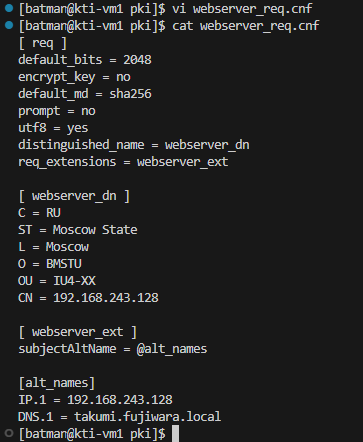


```bash
grep -A 1 "Authority Key Identifier" certs/webserver.crt
```

```bash
grep -A 1 "Subject Key Identifier" certs/ca.crt
```


### Настройка веб-сервера и хоста


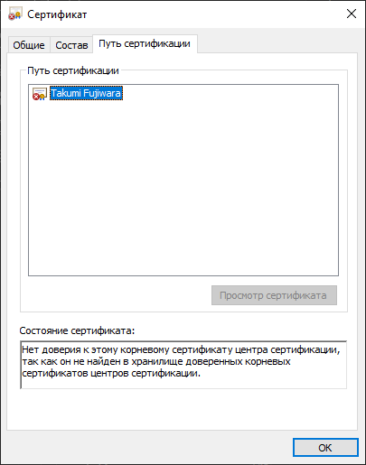


---

## Работа с Git
### Основы Git


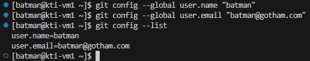

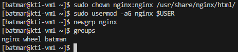


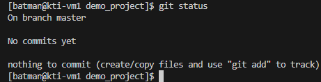


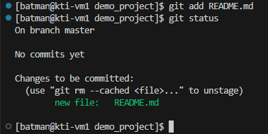

```markdown
This is a demo project created to gain skills in working with Git.

---

Batman
```


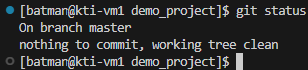


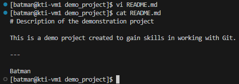


### Принципы использования веток


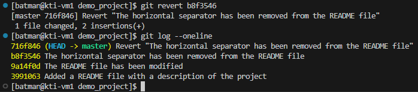


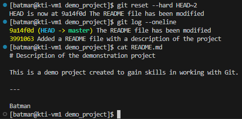


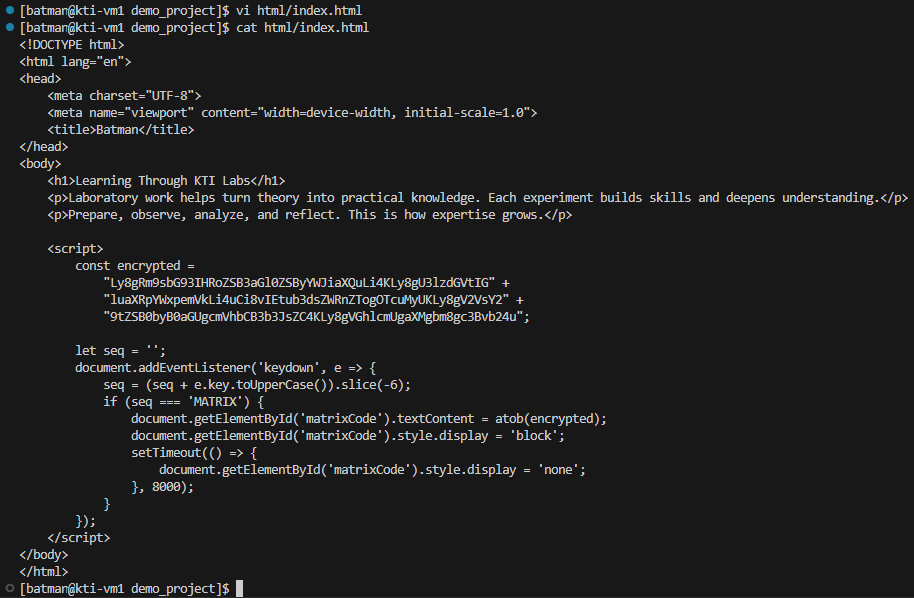


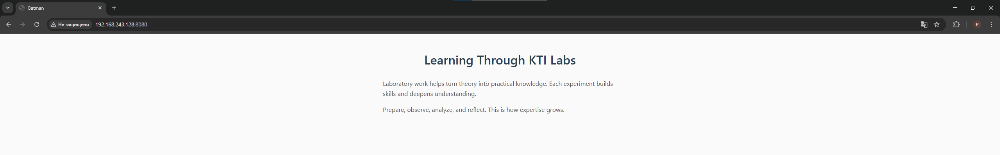


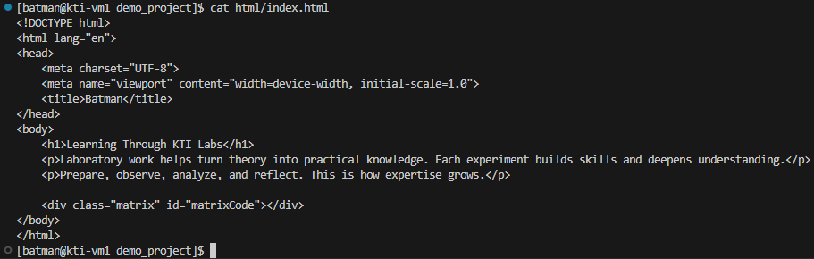


### Использование GitHub

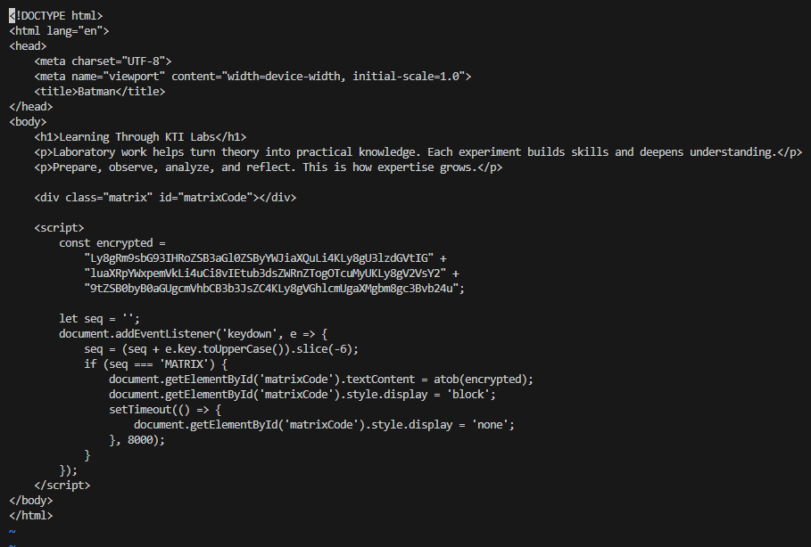


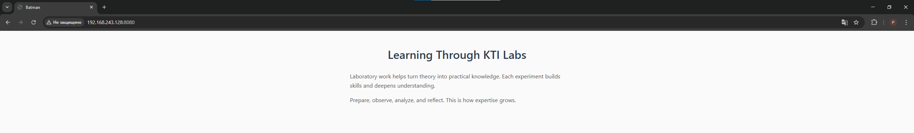


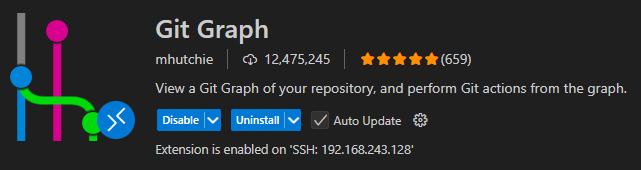

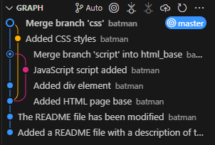


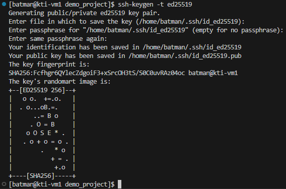


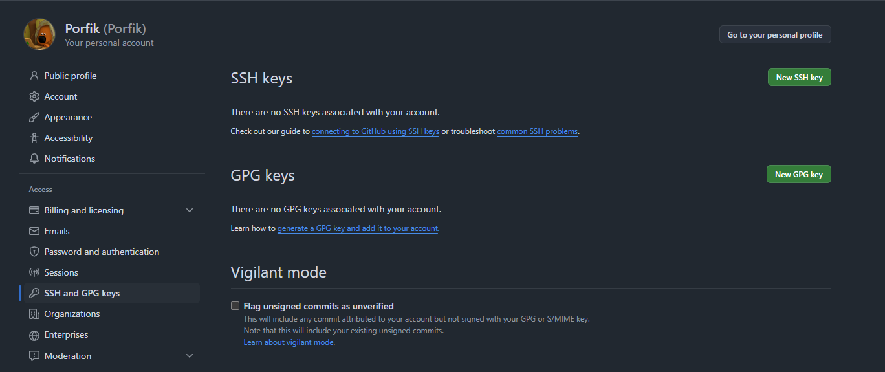


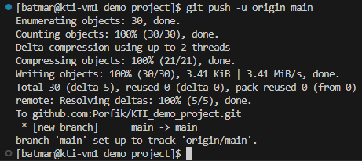