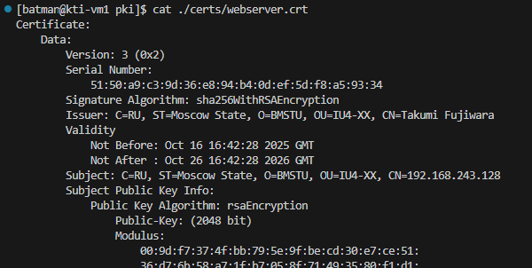
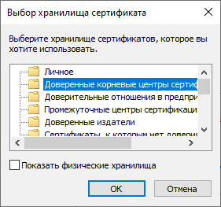

# Выпуск TLS-сертификатов и работа с Git-репозиториями
1. Настройка TLS
	1. Создание сертификатов
	2. Настройка веб-сервера
2. Работа с Git
	1. Основы Git
	2. Принципы разработки с использованием Git
	3. Использование GitHub

---

##### Цель работы:
> Получить навыки по выпуску сертификатов, работе с Git-репозиториями.

---




```bash
grep -A 1 "Authority Key Identifier" certs/webserver.crt
```

```bash
grep -A 1 "Subject Key Identifier" certs/ca.crt
```





