# Выпуск TLS-сертификатов и работа с Git-репозиториями
1. [Настройка TLS](#настройка-tls)
	1. [Создание сертификатов](#создание-сертификатов)
	2. [Настройка веб-сервера и хоста](#настройка-веб-сервера-и-хоста)
2. [Работа с Git](#работа-с-git)
	1. [Основы Git](#основы-git)
	2. [Принципы использования веток](#принципы-использования-веток)
	3. [Использование GitHub](#использование-github)

---

##### Цель работы:
> Получить навыки по выпуску сертификатов, работе с Git-репозиториями.

---

## Настройка TLS
### Создание сертификатов
>[!NOTE]
>Прежде чем браться за настройку TLS, следует разобраться с таким понятием как **PKI**. PKI (Public Key Infrastructure) – инфраструктура открытых ключей, имеет множество вариантов применения, но в основном это шифрование и подпись данных. PKI основана на асимметричном шифровании (это когда для шифрования данных используется один ключ, а для расшифрования - другой). В большинстве случаев данные шифруются закрытым ключом, который хранится в секрете и не распространяется (private key), а расшифровываются на принимающей стороне заранее полученным открытым ключом (public key).
>
>Открытый ключ распространяется не сам по себе, а в составе сертификата (сертификата x.509). Это что-то вроде паспорта, он содержит информацию, позволяющую идентифицировать субъект, которому выдан сертификат (поле `Subject`), указывает, кем он был выпущен (поле `Issuer`), серийный номер сертификата и многое другое. Сертификат можно сгенерировать и подписать самостоятельно (такой сертификат будет называться самоподписанным), а можно приобрести в удостоверяющем центре (УЦ) – организации, специализирующейся на изготовлении сертификатов и электронных цифровых подписей. В первом случае преимуществом будет высокая скорость изготовления, низкие затраты, во втором – сертификат будет приниматься не только на нашем оборудовании, но и у других пользователей.

В данной работе поступим следующим образом – создадим свой локальный УЦ, выпустим его корневой сертификат, который добавим в хранилище доверенных корневых сертификатов на хосте. Это позволит принимать дочерние сертификаты, подписанные нашим УЦ. После чего создадим запрос на сертификат веб-сервера и подпишем его закрытым ключом нашего УЦ. Таким образом получим сертификат с открытым ключом веб-сервера, который будет использовать NGINX при HTTPS-соединении.

Для наглядности и во избежание ошибок каждый файл (ключ, запрос на сертификат и сам сертификат) будем генерировать отдельной командой, используя конфигурационные файлы по мере необходимости. Начнем с закрытого ключа удостоверяющего центра. Но в начале организуем место хранения наших ещё не созданных сертификатов.

```bash
mkdir -p ./pki/{certs,newcerts,private}
```

```bash
cd pki
```

Созданную структуру можно посмотреть используя команду:

```bash
tree
```

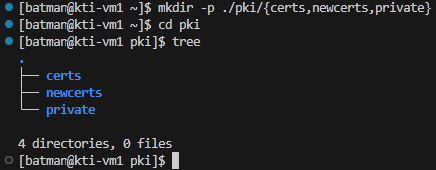

Теперь можем сгенерировать сам ключ.

```bash
openssl genrsa -out ./private/ca.key 4096
```


Мы получили файл с именем `ca.key`, в котором содержится закрытый ключ нашего УЦ, сгенерированный по алгоритму **RSA** с длиной ключа 4096 бит. Следующим шагом напишем конфигурационный файл `ca_req.cnf` для создания на его основе запроса на сертификат. Он будет следующего содержания (*не забудьте изменить* значения полей `OU` и `CN`):

```conf
[ req ]
default_bits = 4096
encrypt_key = no
default_md = sha256
prompt = no
utf8 = yes
distinguished_name = ca_distinguished_name

[ ca_distinguished_name ]
C = RU
ST = Moscow State
L = Moscow
O = BMSTU
OU = IU4-XX
CN = Takumi Fujiwara
```


После чего выполним команду для создания запроса на сертификат:

```bash
openssl req -new -key private/ca.key -out certs/ca.csr -config ca_req.cnf
```


Если мы решим посмотреть на содержание файла с запросом, то увидим некий набор символов.


Это следствие того, что сертификат по умолчанию хранится в формате base64. Однако есть возможность увидеть поля запроса и их значения, например, командой:

```bash
openssl req -text -noout -in certs/ca.csr
```


Теперь можно заметить, что поля `Subject` совпадают со значениями этих полей в конфигурационном файле. Еще одно важное поле - `Modulus`, содержит открытый ключ.

Создадим еще один конфигурационный файл с именем `ca.cnf`, он будет описывать параметры работы нашего удостоверяющего центра.

```conf
[ ca ]
default_ca = batman_ca

[ batman_ca ]
# Путь к каталогу CA
dir               = .
certs             = $dir/certs
new_certs_dir     = $dir/newcerts
database          = $dir/index.txt
serial            = $dir/serial
RANDFILE          = $dir/private/.rand

# Путь к файлам ключей и сертификатов CA
private_key       = $dir/private/ca.key
certificate       = $dir/certs/ca.crt

# Настройки выдачи сертификатов
copy_extensions   = copy
default_days      = 375
default_md        = sha256
preserve          = no
policy            = ca_policy

[ ca_policy ]
countryName = match
stateOrProvinceName = supplied
organizationName = supplied
commonName = supplied
organizationalUnitName = optional
commonName = supplied

[ v3_ca ]
subjectKeyIdentifier = hash
authorityKeyIdentifier = keyid:always,issuer
basicConstraints = critical, CA:true
keyUsage = critical, digitalSignature, cRLSign, keyCertSign

[ server_cert ]
basicConstraints = CA:FALSE
subjectKeyIdentifier = hash
authorityKeyIdentifier = keyid,issuer
keyUsage = critical, digitalSignature, keyEncipherment
extendedKeyUsage = serverAuth
```


Ещё для корректной работы удостоверяющего центра потребуется создать файл с базой данных выпускаемых сертификатов:

```bash
touch index.txt
```

И случайный серийный номер:

```bash
openssl rand -hex 16 > serial
```

И проверим структуру `pki`


Выполним команду для генерации самоподписанного сертификата УЦ:

```bash
openssl ca -selfsign -days 3650 -in certs/ca.csr -out certs/ca.crt -config ca.cnf -extensions v3_ca
```


Результатом выполнения команд является сертификат удостоверяющего центра.


Теперь займёмся сертификатом веб-сервера. Для начала создадим конфигурационный файл `webserver_req.cnf`. На данном этапе важно обратить внимание на значение поля `CN` (Common Name). В этом поле необходимо указать доменное имя или IP-адрес веб-сервера, иначе субъект проверки не будет соответствовать предъявляемому сертификату. В секции `alt_names` задают дополнительные доменные имена и IP-адреса субъекта.

```conf
[ req ]
default_bits = 2048
encrypt_key = no
default_md = sha256
prompt = no
utf8 = yes
distinguished_name = webserver_dn
req_extensions = webserver_ext

[ webserver_dn ]
C = RU
ST = Moscow State
L = Moscow
O = BMSTU
OU = IU4-XX
CN = 192.168.243.128

[ webserver_ext ]
subjectAltName = @alt_names

[alt_names]
IP.1 = 192.168.243.128
DNS.1 = takumi.fujiwara.local
```


При помощи следующей команды создадим и закрытый ключ веб-сервера, и запрос на сертификат веб-сервера (да-да, одной командой сразу!):

```bash
openssl req -new -nodes -keyout webserver.key -out certs/webserver.csr -config webserver_req.cnf
```


Далее следует выпустить сертификат веб-сервера, подписанный закрытым ключом удостоверяющего центра, сделать это можно при помощи команды:

```bash
openssl ca -in certs/webserver.csr -out certs/webserver.crt -config ca.cnf -extensions server_cert
```


Полученный сертификат веб-сервера:


Атрибут `X509v3 Authority Key Identifier` - идентификатор ключа УЦ, которым подписан сертификат. Другими словами, по этому полю можно определить, действительно ли сертификат подписан конкретным удостоверяющим центром. Чтобы это проверить, можно воспользоваться следующими командами:

```bash
grep -A 1 "Authority Key Identifier" certs/webserver.crt
```

```bash
grep -A 1 "Subject Key Identifier" certs/ca.crt
```


Осталось отредактировать конфигурационный файл NGINX, где указать параметры TLS и пути к сертификатам. Предварительно создадим необходимые каталоги и файлы.

В `/etc/nginx/` создадим папку `ssl`. В ней создадим файл `dhparam.pem` - файл с ключевой информацией для поддержки технологии **Forward Secrecy**. Эта технология позволяет не допустить расшифровку трафика TLS-сессии даже при компрометации закрытого ключа сервера. Сгенерировать `dhparam.pem` можно следующей командой:

```bash
sudo openssl dhparam -out /etc/nginx/ssl/dhparam.pem 4096
```


>Генерация может занять некоторое время, поэтому пока-что можете сходить перекусить.

Ещё скопируем в каталог `ssl` сертификат и закрытый ключ веб-сервера.

```bash
sudo cp ./pki/certs/webserver.crt ./pki/webserver.key /etc/nginx/ssl/
```


### Настройка веб-сервера и хоста
Все настройки TLS было бы неплохо вынести в отдельный файл (пусть он называется `ssl_params`, а находится в корневом каталоге конфигураций NGINX). Это позволит его переиспользовать в случае настройки нескольких сайтов. Содержимое файла ([ссылка на референс](https://ssl-config.mozilla.org/)):

```nginx
ssl_certificate ssl/webserver.crt;
ssl_certificate_key ssl/webserver.key;
ssl_session_timeout 1d;
ssl_session_cache shared:SSL:10m;

ssl_dhparam ssl/dhparam.pem;

ssl_protocols TLSv1.2 TLSv1.3;
ssl_ciphers ECDHE-ECDSA-AES128-GCM-SHA256:ECDHE-RSA-AES128-GCM-SHA256:ECDHE-ECDSA-AES256-GCM-SHA384:ECDHE-RSA-AES256-GCM-SHA384:ECDHE-ECDSA-CHACHA20-POLY1305:ECDHE-RSA-CHACHA20-POLY1305:DHE-RSA-AES128-GCM-SHA256:DHE-RSA-AES256-GCM-SHA384;
ssl_prefer_server_ciphers off;
```


>[!NOTE]
>Директивы `ssl_certificate` и `ssl_certificate_key` указывают на расположение сертификата и закрытого ключа сервера, `ssl_protocols` - на используемые протоколы, `ssl_ciphers` – на наборы шифров, `ssl_dhparam` - путь к файлу `dhparam.pem`, сгенерированному немного ранее.

Наконец, внесем изменения в конфиг NGINX:

```nginx
upstream flask_app {
    server 127.0.0.1:8000;
}

server {
    listen 80;
    server_name _;
    return 301 https://$host$request_uri;
}


server {
    listen 443 ssl;
    server_name _;
    include /etc/nginx/ssl_params;

    location / {
        proxy_set_header X-Forwarded-For $proxy_add_x_forwarded_for;
        proxy_set_header X-Forwarded-Proto $scheme;
        proxy_set_header Host $http_host;
        proxy_redirect off;
        proxy_pass http://flask_app;
    }
}
```


>[!NOTE]
>Создан новый виртуальный сервер на порту 80, а порт имеющегося изменен на 443. Предварительно заполненный файл `ssl_params` с настройками TLS подключен директивой `include`, в которой указан абсолютный путь к этому файлу.

Теперь скачаем файл сертификата на хост для его последующей установки на оном.


Откроем скачанный файл. В глаза бросается, что наша операционная система не доверяет данному сертификату. Это можно исправить, установив его в хранилище доверенных корневых сертификатов (кнопка `Установить сертификат...`).

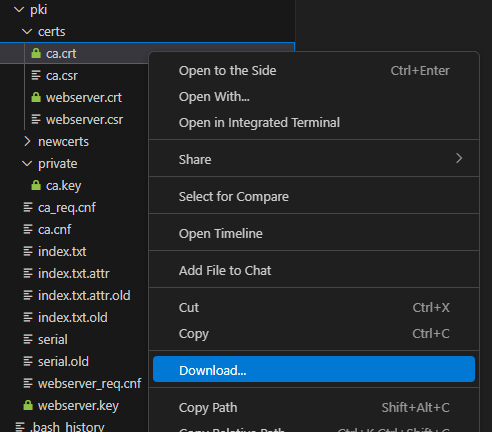

Во вкладке `Состав` можно посмотреть более подробную информацию о сертификате.


Установим сертификат:


После установки еще раз откроем сертификат на хосте.


Теперь ОС хоста будет доверять всем сертификатам, подписанным закрытым ключом нашего импровизированного удостоверяющего центра.

Проверим работу сайта по протоколу HTTPS:


Видим значок, сигнализирующий о корректной проверке сертификата сайта браузером. Кликнув на него и выбрав соответствующий пункт в выпадающем меню, можно увидеть и сам сертификат.

>[!NOTE]
>Добавим пару слов про строчку в конифге NGINX `return 301 https://$host$request_uri;`. Смысл этой настройки в том, чтобы принудительно направить браузер на HTTPS версию сайта, даже если пользователь пытается открыть его по HTTP. В таком случае сервер отправляет клиенту ответ с кодом `301` (Moved Permanently) и новым адресом. Браузер запоминает этот ответ и в следующий раз возьмет этот ответ из кэша и откроет HTTPS версию быстрее.

Попытаемся намеренно открыть сайт по протоколу HTTP:


Открыв в браузере консоль разработчика (F12) и обратившись к сайту по HTTP види следующую картину:


Если на хосте есть права администратора, можно провернуть еще один фокус. Откроем файл `C:\Windows\System32\drivers\etc\hosts` и добавим в него строку с IP-адресом виртуальной машины и доменным именем, которое было добавлено в сертификат.


При попытке сохранить файл может появиться сообщение о том, что доступ запрещен. Следует выбрать `Retry as Admin…`:

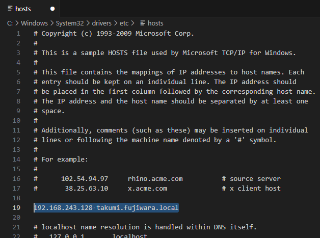

Если все выполнено верно, в браузере можно открыть сайт не по IP-адресу, а по доменному имени. Браузер считает подключение валидным, потому что доменное имя добавлено в расширения сертификата:


На данном этапе настроена инфраструктура открытых ключей, созданы сертификаты УЦ и веб-сервера, а сам веб-сервер настроен на работу по протоколу HTTPS.

---

## Работа с GIT
### Основы GIT
>[!NOTE]
>При разработке ПО удобно хранить код в системе контроля версий. Это позволяет контролировать процесс разработки, оперативно откатываться к предыдущим версиям, распараллеливать разработку между несколькими людьми, в случае хранения кода во внешнем репозитории - иметь доступ к актуальной версии ПО из любой точки с доступом в интернет. В данных лабораторных работах в качестве системы контроля версий выступает GIT.

Проверить, установлен ли GIT, а заодно узнать его версию можно так:

```bash
git --version
```


После установки необходимо выполнить настройки имени пользователя и почты для того, чтобы система могла указать правильные сведения о авторе изменений в файлах:

```bash
git config --global user.name "batman"
```

```bash
git config --global user.email "batman@gotham.com"
```

Эти и другие настройки могут быть записаны в файл `~/.gitconfig`. Посмотреть его можно командой:

```bash
git config --list
```


Создадим директорию нового проекта, а в ней - новый репозиторий командой:

```bash
git init
```


После инициализации репозитория появилась скрытая папка `.git`, в которой находятся служебные файлы, относящиеся к GIT:


Проверить статус созданного репозитория можно командой:

```bash
git status
```

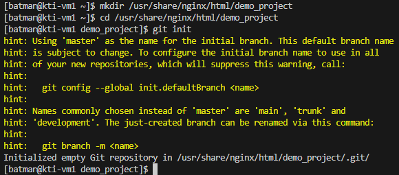

>[!NOTE]
>Строка `On branch master` показывает, в какой ветке (branch) мы сейчас находимся. Строка `No commits yet` говорит о том, что пока еще нет ни одного коммита.

Создадим новый файл в нашем репозитории.

```bash
echo "# Description of the demonstration project" > README.md
```

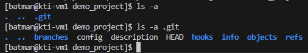


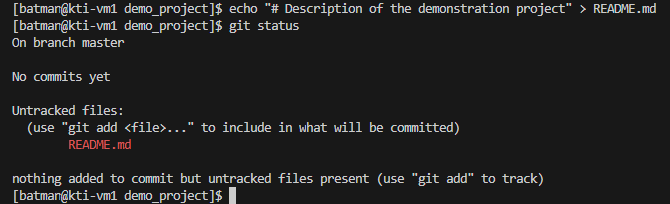


```markdown
This is a demo project created to gain skills in working with Git.

---

Batman
```

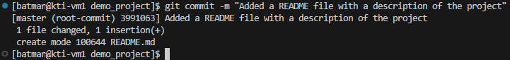


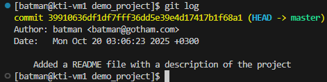


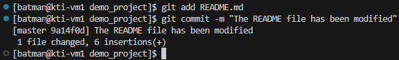

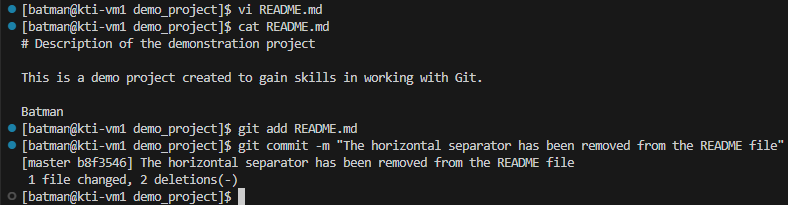


### Принципы использования веток


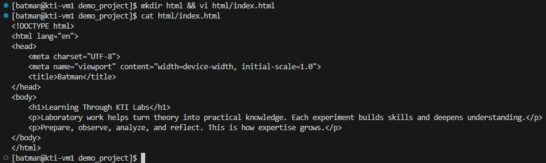


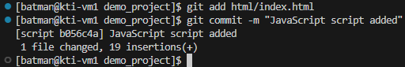


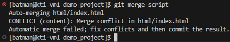


### Использование GitHub


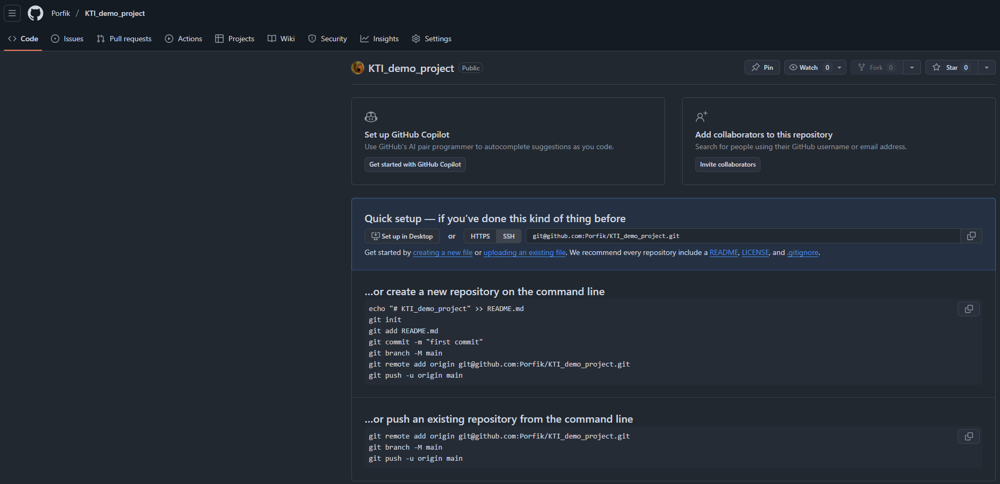


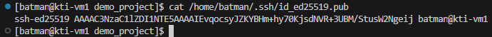


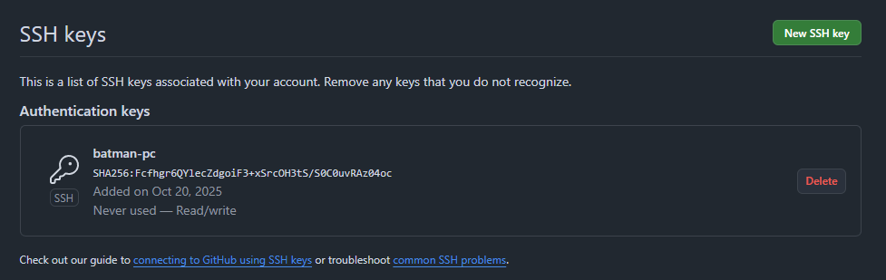

