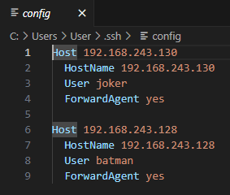
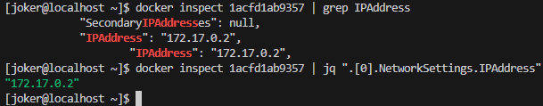
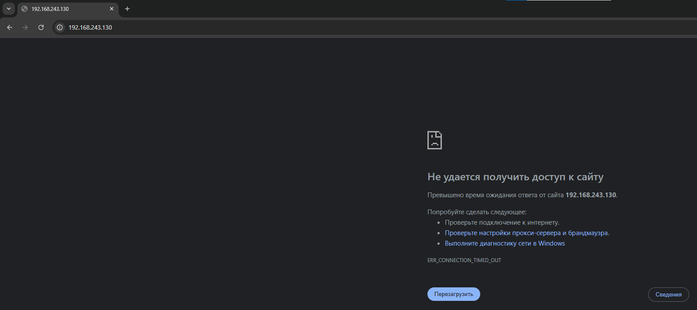
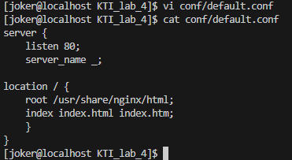
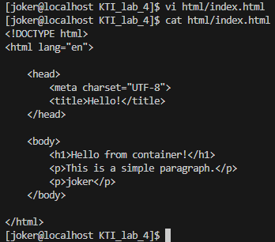
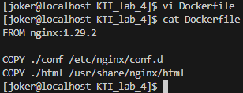
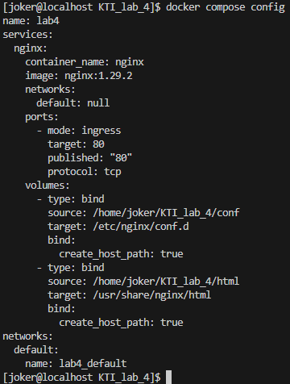
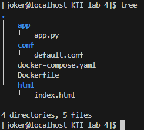

# Инфраструктура в контейнерах
1. Docker
	1. Установка Docker
	2. Запуск контейнеров
	3. Сборка образа контейнера
2. Docker Compose
	1. Работа с контейнерами
	2. Переменные окружения
3. Автоматизация развёртки приложения
	1. Предварительные настройки окружения
	2. 

---

##### Цель работы:
>Получение навыков работы с контейнерами при помощи Docker и Docker Compose, а также автоматизации развёртки приложений.

---

## Docker
### Установка Docker

>[!WARNING]
>Данная лабораторная работа выполняется на новой виртуальной машине, созданной по [аналогии с первой](Lab_1/#создание-новой-вм).

>[!NOTE]
>В последней лабораторной работе рассмотрим другой подход развёртывания приложений и сопутствующей инфраструктуры, а именно — использование для этих задач изолированных сред: контейнеров. Мы будем использовать Docker  — это платформа для запуска приложений в изолированных средах (контейнерах).
>
>Docker-контейнеры — это самодостаточные программные модули, инкапсулирующие ПО и его зависимости: код, библиотеки, настройки окружения. В отличие от виртуальных машин, контейнеры используют ядро хост-системы и изолируют процессы на уровне ОС, что делает их более быстрыми и ресурсоэффективными. Это позволяет разработчикам создавать и тестировать приложения в одинаковых условиях независимо от окружения — будь то локальный компьютер, сервер или облачное хранилище.

Для начала установим Docker. Актуальное руководство по установке можно найти [здесь](https://docs.docker.com/engine/install/centos/). Рекомендуемый метод установки - настроить репозиторий и установить Docker из него.

```bash
sudo dnf config-manager --add-repo https://download.docker.com/linux/centos/docker-ce.repo
```

```bash
sudo dnf install docker-ce docker-ce-cli containerd.io docker-buildx-plugin docker-compose-plugin -y
```




После установки будет создана новая пользовательская группа с названием `docker`. Запустим службу Docker (заодно включив автозапуск) и добавим в неё своего пользователя:

```bash
sudo systemctl enable --now docker
```

```bash
sudo usermod -aG docker $USER
```

```bash
newgrp docker
```


Перезапустим виртуальную машину и снова зайдём в группу `docker`.

```bash
newgrp docker
```

Проверить работоспособность Docker-а и правильно ли всё установлено можно командой:

```bash
docker container run hello-world
```

>[!NOTE]
>Эту команду используют в первую очередь для проверки корректности установки и настройки Docker: она скачивает (если ещё не загружен) специальный тестовый образ `hello-world` с [Docker Hub](https://hub.docker.com/), запускает на его основе контейнер, который выводит простое приветственное сообщение в терминал, подтверждая, что Docker работает должным образом, а затем завершает свою работу.


Список доступных команд для работы с контейнерами в Docker можно посмотреть с помощью флага `--help`

```bash
docker container --help
```


### Запуск контейнеров
>[!NOTE]
>В контейнерах запускаются процессы, определенные образами. Эти образы состоят из одного или нескольких слоев (или наборов различий) плюс некоторых метаданных. Один из способов взглянуть на образы и контейнеры — это рассматривать их как программы и процессы. Точно так же как процесс может рассматриваться «выполняемым приложением», контейнер может рассматриваться как образ, выполняемый докером.

 Запустим Docker-контейнер с уже знакомым нам веб-сервером NGINX, для этого выполним команду:

```bash
docker run -d nginx
```

>[!NOTE]
>`-d` (от detached) — флаг, указывающий Docker запустить контейнер в фоновом режиме, то есть без привязки к текущему терминалу. Это позволяет продолжать работу в командной строке, пока контейнер работает в фоне. 
>
>`nginx` — имя официального образа веб-сервера NGINX из Docker Hub.
>
>В результате команда запускает контейнер с NGINX, который начинает слушать HTTP-запросы (по умолчанию на порту 80 внутри контейнера), работая незаметно в фоне.


Посмотреть список запущенных контейнеров можно командой:

```bash
docker container ls
```

А все контейнеры, даже остановленные — командой:

```bash
docker container ls -a
```


>[!NOTE]
>В выводе команды отображаются следующие столбцы:
>`CONTAINER ID` — уникальный идентификатор контейнера;
>`IMAGE` — образ, на основе которого был создан контейнер;
>`COMMAND` — команда, которая была выполнена при запуске контейнера;
>`CREATED` — время, прошедшее с момента создания контейнера;
>`STATUS` — текущее состояние контейнера;
>`PORTS` — порты, которые использует контейнер;
>`NAMES` — имена контейнеров (в данном случае случайно сгенерированные), удобны для ссылки на контейнер вместо ID.

При помощи команды `docker inspect <container id>` можно узнать множество информации о контейнере (и не только). Например, узнать IP-адрес контейнера можно так:

```bash
docker inspect d3d07bb0590d | grep IPAddress
```

Или с помощью:

```bash
docker inspect d3d07bb0590d | jq ".[0].NetworkSettings.IPAddress"
```


Зная IP-адрес контейнера, можно отправить http-запрос при помощи утилиты **curl**:

```bash
curl http://172.17.0.2
```



В ответ получим текст странички со стандартным приветствием NGINX.

Однако при попытке открыть в браузере страницу по адресу нашей виртуальной машины мы не обнаружим ожидаемого приветствия.


Все дело в том, что по умолчанию контейнер запускается изолированно. Используемые сетевые порты доступны внутри изолированной сети Docker, но не снаружи узла, на котором запущен контейнер. Узнаем, прослушивается ли порт 80.

```bash
ss -tpln | grep 80
```









```bash
docker container run -d -p 80:80 --rm --name nginx -v '/home/batman/KTI_lab_4/conf:/etc/nginx/conf.d' -v '/home/batman/KTI_lab_4/html:/usr/share/nginx/html' nginx
```


### Сборка образа контейнера




---

## Docker Compose
### Работа с контейнерами








### Переменные окружения


---

## Автоматизация развёртки приложения
### Предварительные настройки окружения