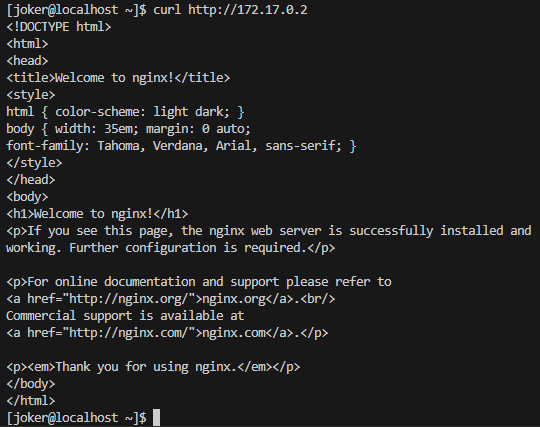
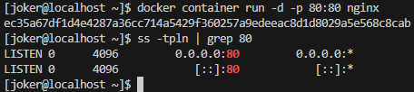
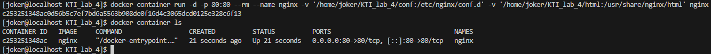
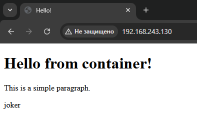
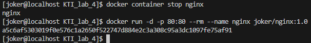
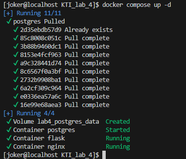
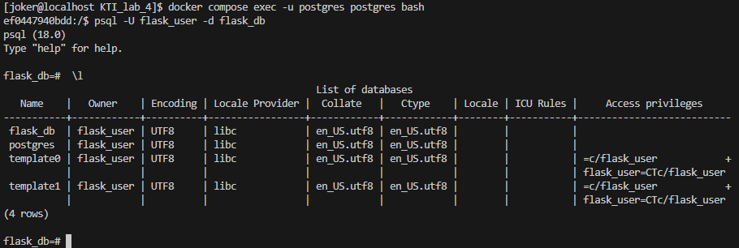

# Инфраструктура в контейнерах
1. Docker
	1. Установка Docker
	2. Запуск контейнеров
	3. Сборка образа контейнера
2. Docker Compose
	1. Работа с контейнерами
	2. Переменные окружения
3. Автоматизация развёртки приложения
	1. Предварительные настройки окружения
	2. 

---

##### Цель работы:
>Получение навыков работы с контейнерами при помощи Docker и Docker Compose, а также автоматизации развёртки приложений.

---

## Docker
### Установка Docker

>[!WARNING]
>Данная лабораторная работа выполняется на новой виртуальной машине, созданной по [аналогии с первой](Lab_1/#создание-новой-вм).


### Запуск контейнеров








```bash
docker container run -d -p 80:80 --rm --name nginx -v '/home/batman/KTI_lab_4/conf:/etc/nginx/conf.d' -v '/home/batman/KTI_lab_4/html:/usr/share/nginx/html' nginx
```





### Сборка образа контейнера





---

## Docker Compose
### Работа с контейнерами






### Переменные окружения


---

## Автоматизация развёртки приложения
### Предварительные настройки окружения