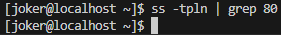
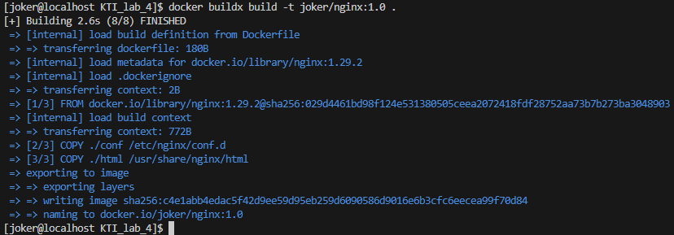
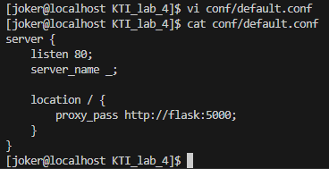
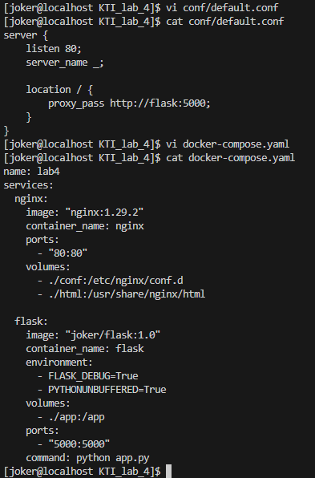
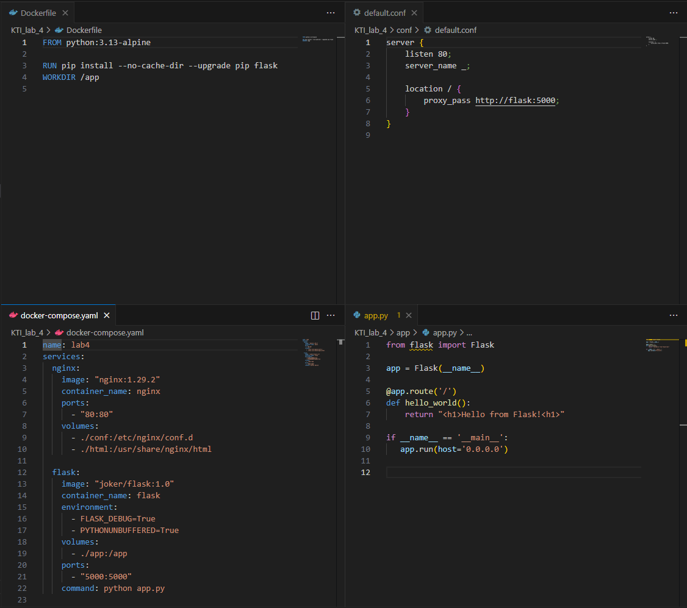
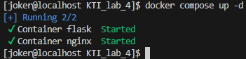
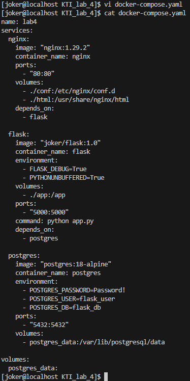
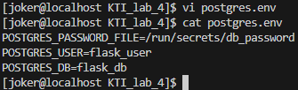

# Инфраструктура в контейнерах
1. [Docker](#docker)
	1. [Установка Docker](#установка-docker)
	2. [Запуск контейнеров](#запуск-контейнеров)
	3. [Сборка образа контейнера](#сборка-образа-контейнера)
2. [Docker Compose](#docker-compose)
	1. [Работа с контейнерами](#работа-с-контейнерами)
	2. [Переменные окружения](#переменные-окружения)
3. [Автоматизация развёртки приложения](#автоматизация-развёртки-приложения)
	1. [Предварительные настройки окружения](#предварительные-настройки-окружения)
	2. 

---

##### Цель работы:
>Получение навыков работы с контейнерами при помощи Docker и Docker Compose, а также автоматизации развёртки приложений.

---

## Docker
### Установка Docker

>[!WARNING]
>Данная лабораторная работа выполняется на новой виртуальной машине, созданной по [аналогии с первой](Lab_1/#создание-новой-вм). Для удобства восприятия лабораторных имя пользователя второй виртуальной машины в методе изменено. У вас имя пользователя *должно быть в том же формате*, что и на первой ВМ.
>
>

>[!NOTE]
>В последней лабораторной работе рассмотрим другой подход развёртывания приложений и сопутствующей инфраструктуры, а именно — использование для этих задач изолированных сред: контейнеров. Мы будем использовать **Docker**  — это платформа для запуска приложений в изолированных средах (контейнерах).
>
>Docker-контейнеры — это самодостаточные программные модули, инкапсулирующие ПО и его зависимости: код, библиотеки, настройки окружения. В отличие от виртуальных машин, контейнеры используют ядро хост-системы и изолируют процессы на уровне ОС, что делает их более быстрыми и ресурсоэффективными. Это позволяет разработчикам создавать и тестировать приложения в одинаковых условиях независимо от окружения — будь то локальный компьютер, сервер или облачное хранилище.

Для начала установим Docker. Актуальное руководство по установке можно найти [здесь](https://docs.docker.com/engine/install/centos/). Рекомендуемый метод установки - настроить репозиторий и установить Docker из него.

```bash
sudo dnf config-manager --add-repo https://download.docker.com/linux/centos/docker-ce.repo
```

```bash
sudo dnf install docker-ce docker-ce-cli containerd.io docker-buildx-plugin docker-compose-plugin -y
```


После установки будет создана новая пользовательская группа с названием `docker`. Запустим службу Docker (заодно включив автозапуск) и добавим в неё своего пользователя:

```bash
sudo systemctl enable --now docker
```

```bash
sudo usermod -aG docker $USER
```

```bash
newgrp docker
```


Перезапустим виртуальную машину и снова зайдём в группу `docker`.

```bash
newgrp docker
```

Проверить работоспособность Docker-а и правильно ли всё установлено можно командой:

```bash
docker container run hello-world
```


>[!NOTE]
>Эту команду используют в первую очередь для проверки корректности установки и настройки Docker: она скачивает (если ещё не загружен) специальный тестовый образ `hello-world` с [Docker Hub](https://hub.docker.com/), запускает на его основе контейнер, который выводит простое приветственное сообщение в терминал, подтверждая, что Docker работает должным образом, а затем завершает свою работу.

Список доступных команд для работы с контейнерами в Docker можно посмотреть с помощью флага `--help`

```bash
docker container --help
```


### Запуск контейнеров
>[!NOTE]
>В контейнерах запускаются процессы, определенные образами. Эти образы состоят из одного или нескольких слоев (или наборов различий) плюс некоторых метаданных. Один из способов взглянуть на образы и контейнеры — это рассматривать их как программы и процессы. Точно так же как процесс может рассматриваться «выполняемым приложением», контейнер может рассматриваться как образ, выполняемый докером.

 Запустим Docker-контейнер с уже знакомым нам веб-сервером NGINX, для этого выполним команду:

```bash
docker run -d nginx
```


>[!NOTE]
>`-d` (от detached) — флаг, указывающий Docker запустить контейнер в фоновом режиме, то есть без привязки к текущему терминалу. Это позволяет продолжать работу в командной строке, пока контейнер работает в фоне. 
>
>`nginx` — имя официального образа веб-сервера NGINX из Docker Hub.
>
>В результате команда запускает контейнер с NGINX, который начинает слушать HTTP-запросы (по умолчанию на порту 80 внутри контейнера), работая незаметно в фоне.

Посмотреть список запущенных контейнеров можно командой:

```bash
docker container ls
```

А все контейнеры, даже остановленные — командой:

```bash
docker container ls -a
```


>[!NOTE]
>В выводе команды отображаются следующие столбцы:
>- `CONTAINER ID` — уникальный идентификатор контейнера;
>- `IMAGE` — образ, на основе которого был создан контейнер;
>- `COMMAND` — команда, которая была выполнена при запуске контейнера;
>- `CREATED` — время, прошедшее с момента создания контейнера;
>- `STATUS` — текущее состояние контейнера;
>- `PORTS` — порты, которые использует контейнер;
>- `NAMES` — имена контейнеров (в данном случае случайно сгенерированные), удобны для ссылки на контейнер вместо ID.

При помощи команды `docker inspect <container id>` можно узнать множество информации о контейнере (и не только). Например, узнать IP-адрес контейнера можно так:

```bash
docker inspect 1acfd1ab9357 | grep IPAddress
```

Или с помощью:

```bash
docker inspect 1acfd1ab9357 | jq ".[0].NetworkSettings.IPAddress"
```


Зная IP-адрес контейнера, можно отправить http-запрос при помощи утилиты **curl**:

```bash
curl http://172.17.0.2
```


В ответ получим текст странички со стандартным приветствием NGINX.

Однако при попытке открыть в браузере страницу по адресу нашей виртуальной машины мы не обнаружим ожидаемого приветствия.


Все дело в том, что по умолчанию контейнер запускается изолированно. Используемые сетевые порты доступны внутри изолированной сети Docker, но не снаружи узла, на котором запущен контейнер. Узнаем, прослушивается ли порт 80 хоста:

```bash
ss -tpln | grep 80
```



Запустить контейнер с пробросом 80 порта хоста на 80 порт контейнера можно опцией `-p 80:80`, таким образом задав соответствие порта виртуальной машины (указывается первым) порту контейнера (указывается вторым).

```bash
docker container run -d -p 80:80 nginx
```


Как видно, Docker не скачивает повторно образ NGINX, а запускает процесс из уже имеющегося образа в локальном репозитории.

В списке контейнеров и выводе `docker inspect` можно заметить открытые порты:

```bash
docker inspect ec35a67df1d4 | jq ".[0].NetworkSettings.Ports"
```

```bash
docker inspect 1acfd1ab9357 | jq ".[0].NetworkSettings.Ports"
```


Откроем страницу по IP-адресу виртуальной машины:


При запуске NGINX в контейнере возможно изменить его конфигурацию. Для этого можно примонтировать в контейнер директории файловой системы хоста при помощи опции `-v` (от слова volume). Создадим в домашней директории пользователя директорию `KTI_lab_4`, в ней два каталога: `conf` для конфигурационных файлов NGINX и `html` с html-файлами.

```bash
mkdir -p KTI_lab_4/{conf,html}
```

И проверим созданную структуру:

```bash
cd KTI_lab_4/
```

```bash
tree
```


В директории `conf` создадим файл `default.conf` следующего содержания:

```bash
vi conf/default.conf
```

```nginx
server {
    listen 80;
    server_name _;

location / {
    root /usr/share/nginx/html;
    index index.html index.htm;
    }
}
```


А в `html` файл `index.html`.

```bash
vi html/index.html
```

```html
<!DOCTYPE html> 
<html lang="en"> 

    <head> 
        <meta charset="UTF-8"> 
        <title>Hello!</title> 
    </head> 

    <body> 
        <h1>Hello from container!</h1> 
        <p>This is a simple paragraph.</p>
        <p>joker</p>
    </body> 

</html>
```


Раньше для того, чтобы изменения вступили в силу, мы перезапускали приложение. То есть, останавливали процесс и запускали заново. В случае с контейнерами будем делать то же самое: останавливать контейнер, удалять его и запускать новый. Для остановки пропишем команду:

```bash
docker container stop $(docker container ls -q)
```


>[!NOTE]
>Разберём команду по частям:
>- `docker container ls -q` — выводит только ID всех запущенных контейнеров (флаг `-q` означает quiet — тихий режим, без заголовков и лишней информации);
>- `$(...)` — это подстановка результата команды. То есть сначала выполняется `docker container ls -q`, и полученные ID передаются в качестве аргументов команде `docker container stop`;
>- `docker container stop` — корректно завершает указанные контейнеры.

Удалить все контейнеры можно аналогично:

```bash
docker container rm $(docker container ls -aq)
```

Проверим, остались ли контейнеры.

```bash
docker container ls -a
```


После того, как все контейнеры удалены, можно вернуться к запуску NGINX с пользовательским конфигом и страничкой приветствия. Команда для запуска контейнера NGINX с двумя примонтированными директориями примет вид:

```bash
docker container run -d -p 80:80 --rm --name nginx -v '/home/joker/KTI_lab_4/conf:/etc/nginx/conf.d' -v '/home/joker/KTI_lab_4/html:/usr/share/nginx/html' nginx
```


>[!NOTE]
>Разберём новые аргументы команды запуска:
>- `--rm` — автоматически удаляет контейнер после его остановки (удобно для временных или тестовых запусков);
>- `--name nginx` — присваивает контейнеру имя `nginx` (вместо случайно сгенерированного);
>- `-v '/home/joker/KTI_lab_4/conf:/etc/nginx/conf.d'` — монтирует локальную директорию `/KTI_lab_4/conf` с конфигурационными файлами NGINX в контейнер по пути `/etc/nginx/conf.d`;
>- `-v '/home/joker/KTI_lab_4/html:/usr/share/nginx/html'` — монтирует локальную директорию `/KTI_lab_4/html` с html-файлами в контейнер по пути `/usr/share/nginx/html`.

Попробуем открыть сайт по IP-адресу виртуальной машины:


Веб-сервер функционирует, однако команда для запуска контейнера становится все более и более громоздкой.

### Сборка образа контейнера
>[!NOTE]
>Можно пойти другим путем и собрать образ, включив в него файлы нашего приложения. Образ контейнера (**Docker image**) — это статичный шаблон, содержащий всё необходимое для запуска приложения: код, библиотеки, зависимости, системные инструменты, настройки и команду по умолчанию для запуска. Образ состоит из слоёв (layers) — каждая инструкция в Dockerfile создаёт новый слой, который содержит только изменения относительно предыдущего. Благодаря этому образы легко переиспользуются и быстро собираются.

В каталоге `KTI_lab_4` создадим файл с именем `Dockerfile` без расширения.

```bash
vi Dockerfile
```

Содержимое файла:

```docker
FROM nginx:1.29.2

COPY ./conf /etc/nginx/conf.d 
COPY ./html /usr/share/nginx/html
```


>[!NOTE]
>Разберём каждую строку:
>- `FROM nginx:1.29.2` — использует официальный образ NGINX версии 1.29.2 в качестве базы для нового образа;
>- `COPY ./conf /etc/nginx/conf.d` — копирует локальную папку `./conf` в директорию `/etc/nginx/conf.d` внутри контейнера;
>- `COPY ./html /usr/share/nginx/html` — копирует локальную папку `./html` в директорию `/usr/share/nginx/html`.

Теперь соберём образ из файла находясь в каталоге `KTI_lab_4` (точка в конце соответствующей команды нужна).

```bash
docker buildx build -t joker/nginx:1.0 .
```



Созданный образ появится в локальном репозитории Docker-образов.

```bash
docker image ls
```


Остановим старый контейнер с NGINX.

```bash
docker container stop nginx
```

И из только что собранного образа запустим контейнер командой:

```bash
docker run -d -p 80:80 --rm --name nginx joker/nginx:1.0
```


Можно проверить содержимое интересующих нас файлов в контейнере.

```bash
docker container exec nginx cat /etc/nginx/conf.d/default.conf
```

```bash
docker container exec nginx cat /usr/share/nginx/html/index.html
```


Проверим работоспособность запущенного контейнера.


И перед следующим этапом опять остановим контейнер с NGINX.

```bash
docker container stop nginx
```


---

## Docker Compose
### Работа с контейнерами
>[!NOTE]
>**Docker Compose** — это инструмент для управления многоконтейнерными приложениями с помощью одного файла конфигурации в формате **YAML** (обычно `docker-compose.yml`), в котором описываются все сервисы — такие как веб-сервер, база данных и т.д. — вместе с их образами, портами, томами, переменными окружения и зависимостями. Вместо того чтобы запускать каждый контейнер отдельной командой, разработчик может развернуть всю систему одной командой `docker compose up` и остановить командой `docker compose down`.

Проверить версию и факт установки Docker Compose можно так:

```bash
docker compose version
```


Файл с инструкциями `docker-compose.yaml` создадим в директории `KTI_lab_4`.

```bash
vi docker-compose.yaml
```

И заполним следующим образом:

```docker
name: lab4
services:
  nginx:
    image: "nginx:1.29.2"
    container_name: nginx
    ports:
      - "80:80"
    volumes:
      - ./conf:/etc/nginx/conf.d
      - ./html:/usr/share/nginx/html
```


При написании файлов формата YAML следует внимательно относиться к отступам — они являются частью синтаксиса. Проверить конфигурацию на корректность можно командой:

```bash
docker compose config
```


Теперь запустим контейнер:

```bash
docker compose up
```


Загрузки веб-страницы будут логироваться и выводиться в консоль.


Выйти из просмотра логов и остановить выполнение можно при помощи сочетания клавиш `Ctrl+C`. Запуск Docker Compose в фоновом режиме осуществляется добавлением в состав команды запуска ключа `-d`.

Для следующего этапа проекта соберем новый образ — на основе Python с фреймворком Flask. Для этого возьмем за основу официальный образ Python и соберем новый, добавив новым слоем Flask. Изменим имеющийся `Dockerfile`:

```bash
vi Dockerfile
```

```docker
FROM python:3.13-alpine

RUN pip install --no-cache-dir --upgrade pip flask
WORKDIR /app
```


И соберем образ.

```bash
docker buildx build -t joker/flask:1.0 .
```


Создадим в директории `KTI_lab_4` каталог `app`, а в ней файл `app.py`.

```bash
mkdir app && vi app/app.py
```

```python
from flask import Flask

app = Flask(__name__)

@app.route('/')
def hello_world():
    return "<h1>Hello from Flask!<h1>"

if __name__ == '__main__':
   app.run(host='0.0.0.0')
   
```


Изменим файл `default.conf`:

```bash
vi conf/default.conf
```

```nginx
server {
    listen 80;
    server_name _;

    location / {
        proxy_pass http://flask:5000;
    }
}
```



Добавим в файл `docker-compose.yaml` сервис `flask`:

```bash
vi docker-compose.yaml
```

```docker
name: lab4
services:
  nginx:
    image: "nginx:1.29.2"
    container_name: nginx
    ports:
      - "80:80"
    volumes:
      - ./conf:/etc/nginx/conf.d
      - ./html:/usr/share/nginx/html

  flask:
    image: "joker/flask:1.0"
    container_name: flask
    environment:
      - FLASK_DEBUG=True
      - PYTHONUNBUFFERED=True
    volumes:
      - ./app:/app
    ports:
      - "5000:5000"
    command: python app.py
```



На данном этапе структура проекта должна выглядеть так:




Запустим.

```bash
docker compose up -d 
```



И посмотрим страничку доступную теперь по IP-адресу ВМ.


Логи контейнеров можно посмотреть командой:

```bash
docker compose logs -f
```


>[!NOTE]
>Флаг `-f` отвечает за отображение логов в реальном времени.

Теперь добавим в проект **PostgreSQL** в качестве СУБД. Для этого добавим еще один сервис в файл `docker-compose.yaml`.

```bash
vi docker-compose.yaml
```

```docker
name: lab4
services:
  nginx:
    image: "nginx:1.29.2"
    container_name: nginx
    ports:
      - "80:80"
    volumes:
      - ./conf:/etc/nginx/conf.d
      - ./html:/usr/share/nginx/html
    depends_on:
      - flask

  flask:
    image: "joker/flask:1.0"
    container_name: flask
    environment:
      - FLASK_DEBUG=True
      - PYTHONUNBUFFERED=True
    volumes:
      - ./app:/app
    ports:
      - "5000:5000"
    command: python app.py
    depends_on:
      - postgres

  postgres:
    image: "postgres:18-alpine"
    container_name: postgres
    environment:
      - POSTGRES_PASSWORD=Password!
      - POSTGRES_USER=flask_user
      - POSTGRES_DB=flask_db
    ports:
      - "5432:5432"
    volumes:
      - postgres_data:/var/lib/postgresql/data

volumes:
  postgres_data:
```



После запуска увидим запущенный контейнер с PostgreSQL.

```bash
docker compose up -d
```


Для диагностики бывает полезно подключиться к командной оболочке запущенного контейнера в интерактивном режиме. Это можно сделать разными способами. Один из них — подключение из командной строки. Попробуем подключиться к сервису `postgres`:

```bash
docker compose exec -u postgres postgres bash
```

Внутри зайдем в консоль БД.

```bash
psql -U flask_user -d flask_db
```

И введём команду, которая показывает все развернутые базы данных.

```postgresql
 \l
```


### Переменные окружения





```bash
vi docker-compose.yaml
```

```docker
name: lab4
services:
  nginx:
    image: "nginx:1.29.2"
    container_name: nginx
    ports:
      - "80:80"
    volumes:
      - ./conf:/etc/nginx/conf.d
      - ./html:/usr/share/nginx/html
    depends_on:
      - flask

  flask:
    image: "joker/flask:1.0"
    container_name: flask
    env_file:
      - flask.env
    volumes:
      - ./app:/app
    ports:
      - "5000:5000"
    command: python app.py
    depends_on:
      - postgres

  postgres:
    image: "postgres:18-alpine"
    container_name: postgres
    env_file:
      - postgres.env
    secrets:
      - db_password
    ports:
      - "5432:5432"
    volumes:
      - postgres_data:/var/lib/postgresql/data

secrets:
  db_password:
    file: ./db_password

volumes:
  postgres_data:
```


---

## Автоматизация развёртки приложения
### Предварительные настройки окружения