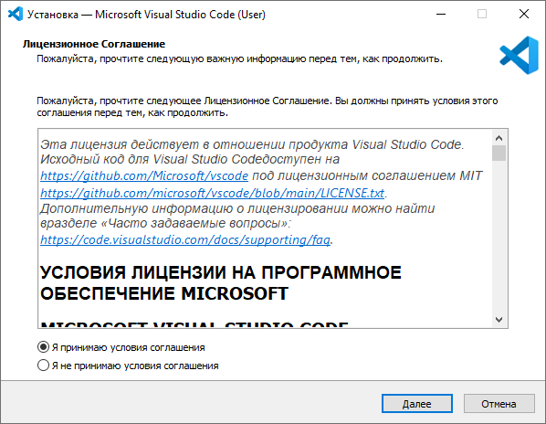
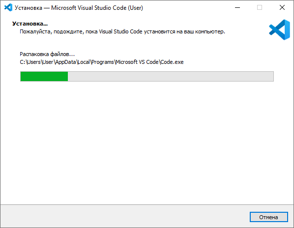
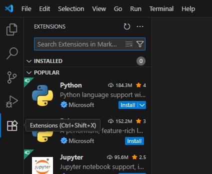
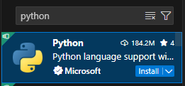
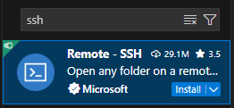
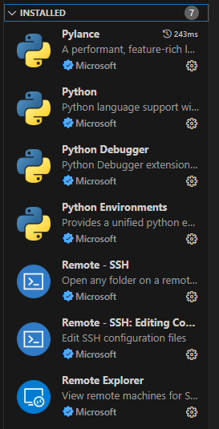
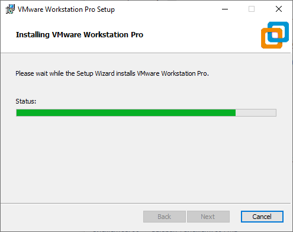
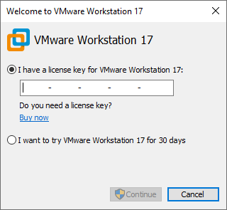

# Подготовка к лабораторным работам
## Скачивание нужных файлов
Прежде всего вам нужно скачать установочные файлы и ISO-образ.

Скачать их можно по этим ссылкам:
- [Установщик гипервизора и ISO-образ Rocky Linux](https://drive.google.com/drive/folders/1F3HMSls1LDoprFnNyDuAwhaRnjSfKjem)
- [Установщик VS Code](https://code.visualstudio.com/)

После этого у вас на компьютере должны быть файлы как на скриншоте ниже:

## Установка VS Code и расширений
Установка VS Code тривиальна и особых пояснений не требует, скриншоты приведены в качестве реперных точек.

После окончания установки откройте программу и перейдите во вкладку `Extensions` (расширения).

Для выполнения лабораторных работ нам нужно скачать плагины для работы с **Python** и **SSH**. Для этого вводим соответствующие названия в поисковую строку и нажимаем на кнопку `Install`.

>[!WARNING]
>Если после начала скачивания расширения загружаются бесконечно долго (больше 1,5 минут) попробуйте включить VPN и начать установку заново.

После установки у вас должна наблюдаться такая картина:

---

## Установка VMware Workstation Pro
Здесь, как и с VS Code, процедура установки не требует пояснений.

При первом открытии установленного гипервизора появится такое окно:

Так как 30 пробных дней нам не хватит, мы позаимствуем лицензионный ключ [отсюда](https://github.com/hegdepavankumar/VMware-Workstation-Pro-17-Licence-Keys) и вставим в соответствующее поле.

---

На этом подготовка к лабам окончена, мы установили весь нужный софт и расширения. Теперь остаётся только предвкушать начало лабораторных работ, выполнение которых точно не оставит вас равнодушными.